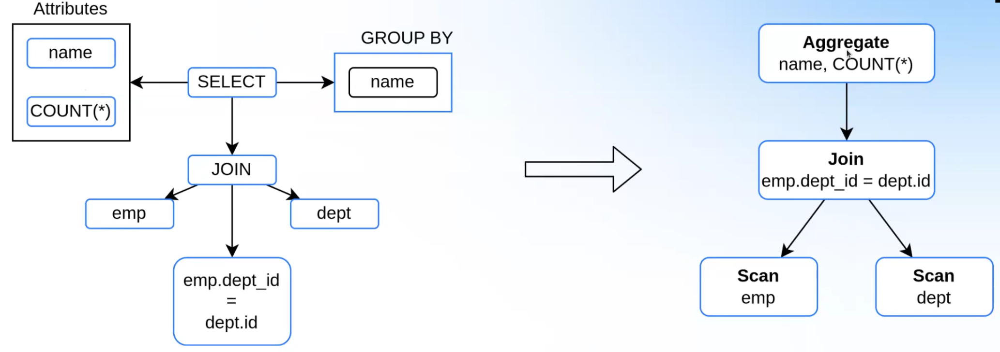
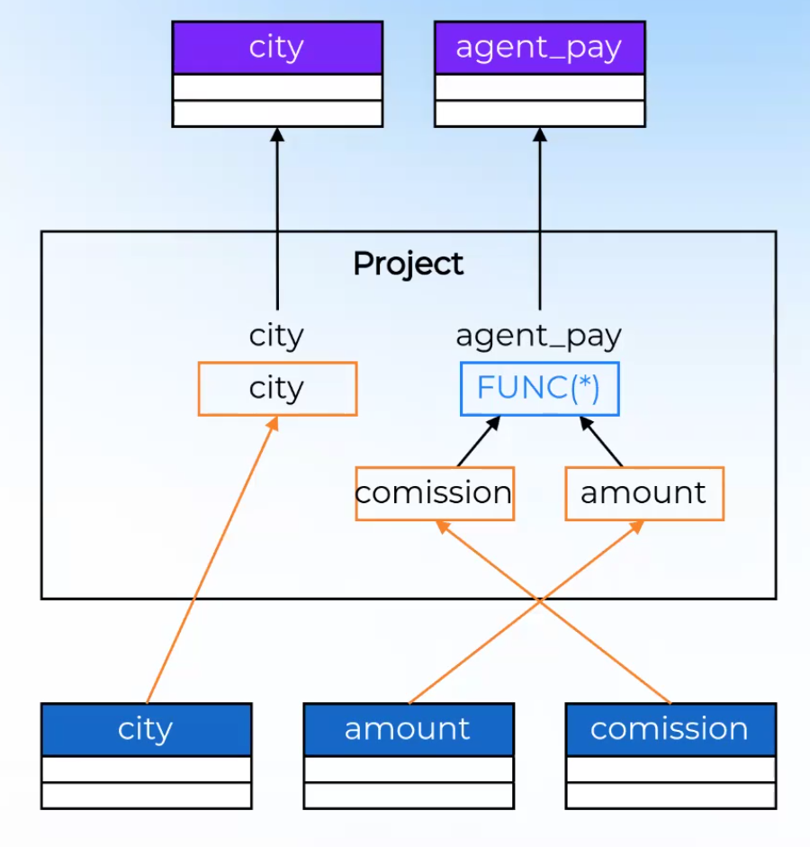
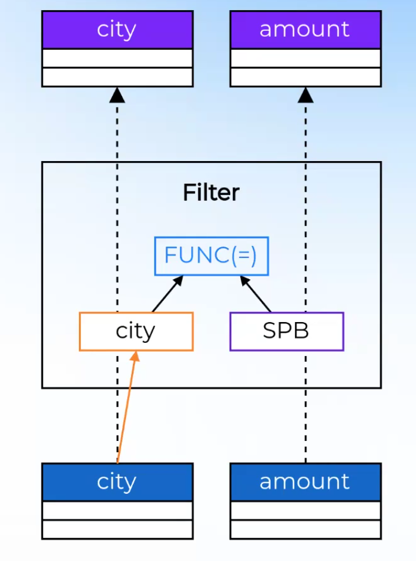
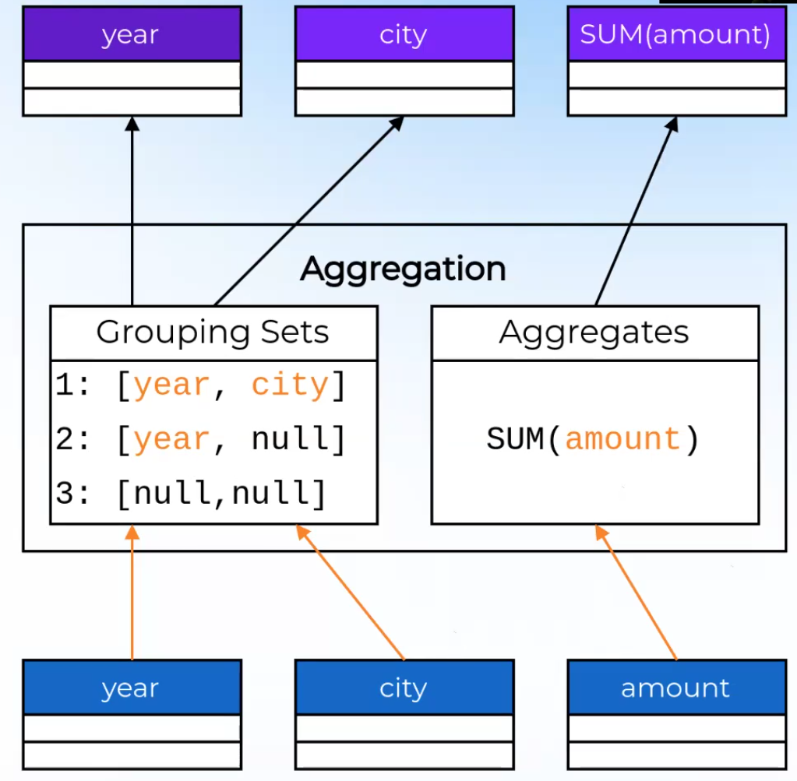
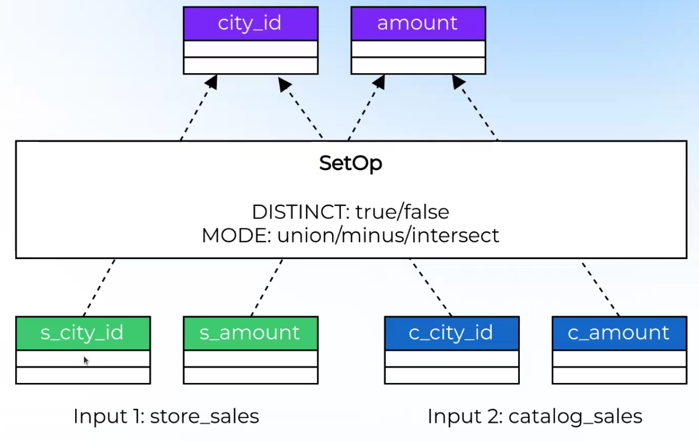

# Лекция 1. Реляционная алгебра и промежуточное представление запросов

### Основы реляционной алгебры
Алгебра над отношениями. Основополагающий труд – статья [A Relational Model of Data for Large Shared Data Banks, E.Codd (1970)](https://dl.acm.org/doi/abs/10.1145/362384.362685). Сам **язык SQL** – декларативный, описывается, **что** именно нужно сделать, а не каким образом, что оставляет свободу среде выполнения этого языка.

**Тип данных** – описание множества возможных значений и операции над ними.
* Логический: `BOOL`
* Числовые типы: `SMALLINT`, `TINYINT`, `INT`, `BIGINT`, `DECIMAL`, `FLOAT`, `DOUBLE`
* Строковые типы: `CHAR`, `VARCHAR`
* Дата и время: `DATE`, `TIME`, `TIMESTAMP`, `TIMESTAMP WITH TIMEZONE`
* Контейнеры: `ARRAY`, `MAP`
* Специальные: `binary`, `JSON`, `spatial`, ...


**Аттрибут** – это пара <имя, тип>, на практике называют "столбцом". Например:
* `name:VARCHAR`
* `age:INT`

**Значение аттрибута** – величина, принадлежащая типу аттрибута. Например:
* `name:VARCHAR:John`
* `age:INT:30`

**Кортеж (tuple)** – несортированное множество атрибутов и их значений, на практике называют "строкой". Например: `[name:VARCHAR:John, age:INT:30]`.

**Отношений (relation)** – несортированный набор кортежей, может содержать повторяющиеся кортежи, на практикой называют "таблицей".

### Эквивалентные отношения
* Отношения называются **эквивалентными**, если они содержат одинаковый набор кортежей
* Два кортежа равны, если они содержат идентичный набор аттрибутов, и каждая пара одинаковых аттрибутов имеет одинаковые значения
* Порядок кортежей значения не имеет
* Для определения эквивалентности, считаем, что `NULL == NULL => true` (непосредственно в СУБД выражение `NULL == NULL` имеет значение `NULL`, троичная логика)


Следующие два отношения эквивалентны:
| `name:VARCHAR` | `age:INT` |
| -------------- | --------- |
| `John`         | `30`      |
| `Jane`         | `NULL`    |

и 

| `name:VARCHAR` | `age:INT` |
| -------------- | --------- |
| `Jane`         | `NULL`    |
| `John`         | `30`      |

Понятие эквивалентности важно, поскольку нужно определить, какие преобразования оптимизатора запросов будут валидными, а какие – нет. **Два плана считаются эквивалентными**, если при любых входных данных (отношениях) на выходе получаются эквивалентные отношения. Если какой-то план `a` и прямое выполнение являются эквивалентными, то преобразование `a` считается допустимым.

Есть целые проекты, которые занимаются проблемой нахождений неэквивалентных планов, которые выдают промышленные оптимизаторы. Один из таких проектов – [sqlancer](https://github.com/sqlancer/sqlancer). Работает, говоря упрощенно, по следующему принципу: генерирует кучу различных запросов для разных версий оптимизаторов, выполняет планы, а потом сравнивает на эквивалентность получившиеся отношения.

**Реляционный оператор** – функция, принимающая ноль, одна или несколько отношений и возвращающая ноль или одно отношение. Пример: 
* `Scan` принимает 0 отношений и возвращает 1, читает с диска таблицу
* `Filter` принимает 1 отношение и возвращает 1, применяет фильтрацию по предикату
* `Join` принимает 2 отношения и возвращает 1, соединяет несколько таблиц по некоторому правилу
* `Union` принимает 2 отношения и возвращает 1, просто объединяет все кортежи из первого и второго отношений

Два реляционных оператора **эквивалентны**, если они производят эквивалентные отношения для любых наборов входных параметров. Например, `Filter[a = 1 OR a = 2]` и `Filter[a IN (1,2)]`.

### Синтаксический анализ
На вход сервер БД всегда принимает запрос в виде простой строки. Это представление не удобно для анализа, его необходимо преобразовать в более удобное. Зачастую это древовидные структуры. Для этого используют **парсеры** – программы, которые преобразуют строку в синтаксическое дерево. Обычно реализовано с помощью парсер-генераторов. Например:
* [Bison](https://www.gnu.org/software/bison/)(Postgres)
* [ANTLR](https://www.antlr.org/)(Trino)

Для их использования нужно описать в специальном синтаксисе грамматику языка запросов.

### Семантический анализ
На выходе из парсера получаем AST. Это просто токены, упакованные в древовидную структуру. Исходный запрос может быть корректен с точки зрения грамматики SQL, но некорректен с точки зрения **семантики**: например: может быть `JOIN` двух таблиц, которые отсутствуют в базе данных; в функциию передаются неправильное количество аргументов или аргументы не тех типов; у пользователя нет прав для чтения из определенной таблицы (вопрос безопасности) и т.п. Решением таких проблем занимается **семантический анализатор**.

Зачастую такой анализатор реализован в виде монолитного компонента, специфичного для данного движка. Обычно, этот компонент обходит много раз по дереву и делает соответствующие проверки. Этот этап плохо автоматизируется, все проверки пишутся вручную.
Помимо проверок, на этом этапе узлы дерева также "насыщаются" семантической информацией: разрешаются(resolve) функции, проставляются ссылки на таблицы, аттрибуты и т.д.

Некоторые СУБД, например, Postgres, составляют план выполнения прямо на основе AST, без дальнейших трансформаций. У этого подхода есть плюсы: не нужно никаких дополнительных трансформаций, а значит некоторые простые оптимизации можно сделать быстрее. Однако, есть и минусы: AST описывает именно синтаксическую структуру, а не семантическую. Например, `SELECT` может значить многое: как чтение из таблицы, так и чтение + сортировку, так и чтение + сортировку + группировку, и т.д. На уровне AST трудно делать семантические преобразования, поэтому, например, Postgres плохо использует контекст внешнего запроса с оптимизацией подзапроса.

Большинство оптимизаторов трансформирует AST в **дерево реляционных операторов (реляционное дерево)**. Процесс преобразования описывается вручную, идет как один из этапов семантического анализа. Пример:

В виде таких деревьев можно понятным образом описывать планы, которые в виде строкового SQL-запроса описать или невозможно, или невероятно сложно, так, что человек такой код никогда не напишет. В Apache Calcite класс `SqlNode` представляет узлы AST, а класс `RelNode` – узлы реляционного дерева. Класс `SqlToRelConverter` занимается преобразование `SqlNode` в `RelNode`. Такой подход используется в большинстве open-source движков. Набор видов `RelNode` обычно в каждом движке свой, однако в статьях обычно оперируют четырьмя видами узлов:
* Projection – выбор конкретных колонок в отношении
* Selection (Filter) – фильтрация по предикату
* Aggregate – агрегация строк
* Join – соединение отношений

Существует проект [substrait](https://github.com/substrait-io/substrait), который пытается создать универсальный набор реляционных операторов. Цель в том, чтобы различные движки могли обмениваться планами и исполнять их.

### Row expressions
У самих `RelNode` есть внутри какие-то узлы. Например, у `Aggregate` есть колонка, по которой надо агрегировать; у `Join` есть предикат, который может быть очень развесистым и который сам по себе представляет дерево. Такие выражения всегда связаны только с конкретыми строками, а не с общей структорой запроса. Выражения, которые находятся внутри реляционных операторов, называются  **row expressions** и они внутри узлов `RelNode` образуют свои поддеревья. В терминах Apache Calcite они называются `RexNode`. Над такими деревьями часто выполняются оптимизации: например, есть есть фильтр `a > 10 AND a > 20`, то его можно преобразовать просто в `a > 20`. Для такой оптимизации не нужно ничего знать про реляционное дерево.

Зачастую при работе с row expressions применяется паттерн визитор:
```java
interface RowExpression {
    Type getType(); // literal/function call/column/...
    T accept(Visitor<T> visitor);
    equals()/hashCode();
}
```

### Базовые операторы

##### Scan
Листовой поператор, который возвращает данные из какого-либо источника
```SQL
SELECT city, amount
FROM sales -- scan
WHERE city = 'SPB'
```
* Содержит ссылку на объект сканирования: таблицу, индекс, события в Kafka и т.д.
* Может иметь опциональные поля для оптимизации: список колонок для сканирования, дополнительные фильтры

##### Project
Промежуточный оператор, который для каждого входящего кортежа возвращает новый кортеж с другим набором атрибутов. Содержит в себе коллекцию row expression, которые формируют новые аттрибуты. Пример:
```SQL
SELECT
  city, amount * commision 'agent pay' -- projection
FROM Ssales
```

Частая оптимизация в `Project` – переиспользование уже вычисленных выражений. Допустим, помимо `amount * comission`, вычислялось бы где-то `amount * commission + 42`, тогда вычислять `amount * comission` можно было бы единожды, а потом переиспользовать.

##### Filter
Промежуточный оператор, который отфильтровывает отдельные кортежи на основании предиката (row expression). Набор аттрибутов остается неизменным. Пример:
```SQL
SELECT city, amount
FROM sales
WHERE city = 'SPB' -- filter
```


##### Aggregation
Промежуточный оператор, который считает агрегатные функции по заданным ключам. Пример:
```SQL
SELECT 
  year, city,
  SUM(amount) -- aggregate function
FROM sales
GROUP BY ROLLUP 
  year, city -- aggregate keys
```

Особенность `Aggregate` в том, что этот оператор очень сложен: различные функции агрегирования, с `GROUP BY` и без, `ROLLUP`/`CUBE`, добавление сортировки, `DISTINCT` и т.д. Но у всех них есть общие черты: во-первых, всегда есть какая-то агрегатная функция. Во-вторых, есть `grouping sets`: по какому атрибуту делать группировку. В примере таких множества три: отдельно сделать группировку по году и городу, отдельно по только по году, и добавить значение функции вообще без группировки. Зачастую агрегаты декомпозируют: есть некоторое ядро, а сортировки и уникальные значения накручивают сверху.

##### Sort
Промежуточный оператор, который меняет порядок кортежей. С точки зрению SQL, имеет смысл только для отображения конечного результата пользователю, так как в общем случае порядок кортежей не важен. Параметры: сортировка по возрастанию/убыванию, с начала или в конце располагать `NULL`-ы. Пример:
```SQL
SELECT ...
FROM sales
ORDER BY year ASC, city DESC -- sort
```

##### Join
Промежуточный оператор, которые соединяет данные по условию с нескольких входов. В большинстве SQL-движков `Join` является **бинарным** оператором, т.к. это упрощает реализацию. Верхнеуровнево, `Join` перебирает все возможные пары кортежей из двух таблиц, и взависимости от предиката добавляет новый кортеж, состоящий из конкатенации из рассматриваемых двух, или нет. Существуют различные виды `Join`-ов. Обычный `Join` – это `Inner Join`, то есть если предикат не верен, то рассматриваемая пара в итоговое отношение не войдет. Есть `Left/Right Outter Join`, они отличаются тем, что дополняют `NULL`-ами, если для кортежа слева/справа не нашлось ни одного кортежа справа/слева. Также есть `Semi Join`, когда используются колонки только из одного из входных отношений, возникает при подзапросах:
```SQL
SELECT *
FROM A
WHERE EXISTS (SELECT ... FROM b WHERE b.c = a.c)
```

##### Set-операторы
Промежуточный бинарные операторы(`Union All`, `Union`, `Minus`, `Intersect`), которые производят теоретико-множественные операции над кортежами из таблиц. На самом деле, все они выражаются через `Union All` и другие средства SQL. Пример:
```SQL
SELECT s_city_id, s_amount
FROM stores_sales
UNION ALL -- set-operator
SELECT c_city_id, c_amount
FROM catalog_sales
```

