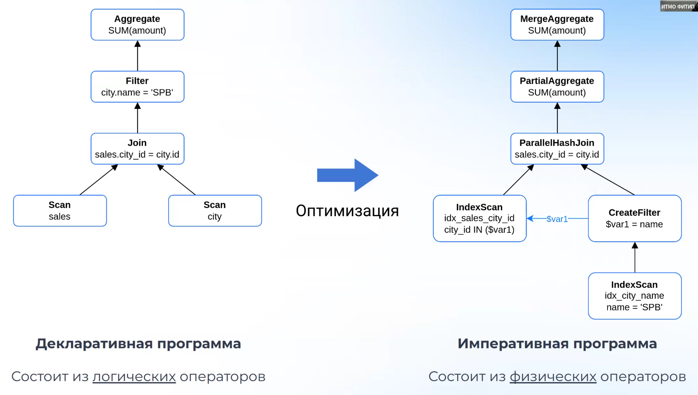
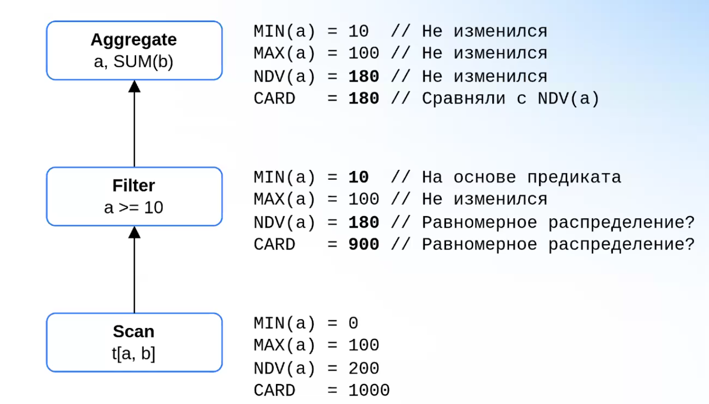
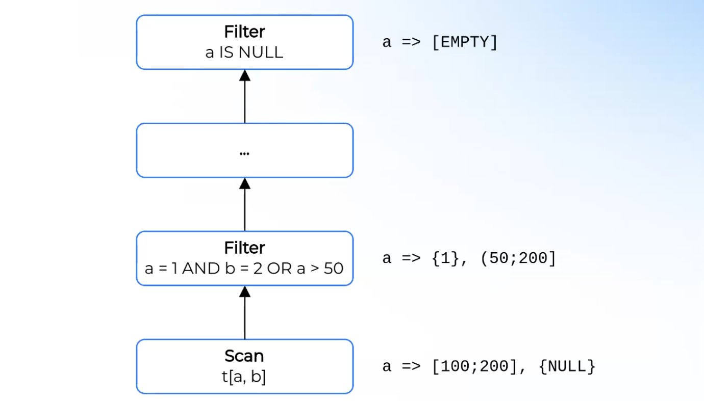

# Лекция 2. Элементы оптимизатора

### Логические и физические операторы
Вспомним из первой лекции реляционное дерево. Оно состоит из реляционных операторов. На самом деле, такое дерево является **декларативным** описанием, поскольку оно просто говорит, например, "просканируй таблицу". Исполнитель запроса не знает, как именно просканировать: таблицу или индекс. Или, например, `Join`: есть разные стратегии `Join`-а: через вложенные циклы, или через хэш-таблицу. Оптимизатор должен выдать, что именно следует делать исполнителю запроса, т.е. предоставить описание в **императивном** стиле.
Пример: 

**Логические операторы** – описывают семантику, могут не иметь достаточного контекста для выполнения.

**Физические операторы** – полностью описывают конкретный алгоритм действий, могут быть выполнены.

**Оптимизатор** – программа, которая трансформирует абстрактный логический план в конкретный физический план.

Пример: логический оператор `Join` может быть трансформирован в физические операторы `HashJoin`, `MergeJoin`.

В Apache Calcite разделение на логические и физические операторы очень строгое. После семантического анализа получается дерево логических операторов, и по правилам Calcite-а, в конце оптимизации должны получиться только физические операторы. При этом, в некоторых промышленных оптимизаторах может быть много фаз, когда создаются промежуточных физические операторы, которые для следующей фазы считаются логическими.

В Trino нет строгого разделения на логические и физические операторы, поскольку Trino является цельным продуктов, а Apache Calcite – конструктором, фреймворком общего назначения. Например, в Trino оператор `Join` всегда является `Hash Join`-ом, потому что так изначально сделали и гибкость в этом месте не предусмотрена.

В реальности бывает сложно сказать, что такое "физический план". Описанный выше взгляд на операторы – концептуальный, он часто используется в общении или в статьях.

### Метаданные
**Метаданные** – любые вспомогательные данные, которые помогают оптимизировать план. Чем больше мы знаем о природе данных, возвращаемых оператором, тем больше полезных оптимизаций мы можем применить. Примеры:
* Если есть `Filter[x < 5]`, но при этом мы знаем, что на вход подается отношение, которое имеет ограничение `x > 10`, то `Filter` заведомо вернет пустой результат. Входное отношение можно даже не сканировать.
* Если мы знаем размеры входов в `HashJoin`, то мы можем строить хэш-таблицу по записям меньшей из таблиц, таким образом можно сэкономить память.
* Если известно, что вход `HashAggregate[GROUP BY a]` отсортирован по ключу `a`, то его можно заменить на `StreamingAggregate`, который не будет потреблять память дополнительную память. В таком случае исполнитель плана будет создавать новую запись только когда в наборе входных данных увидит изменение ключа `a` у последующего кортежа.

Работа с метаданными нетривиальна. 
Для таблиц движки могут выдавать точную информацию, однако, после применения операторов эта информация уже не может быть точной. Например, в таблице содержится 1'000'000 строк, а затем к ней применяется фильтр. Оптимизатор не может знать, как много строк отфильтруется: 1 или 999'999. Поэтому, оптимизатор пытается сохранить приблизительные, неточные метаданные, которые, однако, все равно могут помочь составить более оптимальный план. Зачастую движки используют следующие подходы:
* Рекурсивный подсчет метаданных. Зачастую используется паттерн `Visitor`.
* Поскольку одни и те же метаданные используются много раз, используется кэширование

**Селективность** предиката – доля строк таблицы, на которых предикат верен.

**Кардинальность** оператора – сколько строк в отношении на выходе даст оператор.

**Статистики** – метаданные, которые точно или приблизительно описывают значения атрибутов.
* Row count – сколько строк возвращает оператор. Значение одинаково для всех атрибутов. Помогает оценить стоимость операторов.
* Min/Max – минимальные и максимальные значения атрибутов. Помогают оценить селективность предикатов.
* Null count – сколько `NULL` значений содержит атрибут. Помогает оценить селективность предиката.
* NDV (number of distinct elements) – сколько уникальных значений содержит аттрибут. Помогают оценить кардинальность операторов (`Aggregate`, `Join`, и т.д.), а также селективность фильтров. Могут быть важны NDV комбинаций аттрибутов.
* Гистограммы – показывают распределение значений атрибута. Помогают оценить селективность предиката.

Со статистиками есть проблема: их сложно обновлять. Допустим, в базу постоянно добавляются новые записи, например, в сети магазинов каждую секунду происходит оплата и каждая оплата попадает в базу. Точно пересчитать, допустим, NDV не представляется возможным, будет слишком долго. Поэтому используются приблизительные статистики. Можно так же вообще не пользоваться статистиками, чтобы не было оверхеда на них. Кто-то пересчитывает раз в какое-то время, кто-то постоянно агрессивно их пересчитывает, потому что без них страдает качество планов.

Рассчет статистик для `Scan`-ов статистики можно прочитать напрямую из метаданных таблиц или индексов каким-то образом. Вычисление для промежуточных операторов сложнее. Есть несколько подходов:
* Эвристические формулы: наиболее распространенный подход, неточный. Например, "считаем, что оператор сравнения отфильтровывает 50% всех строк". В случае использования гистограмм или вероятностных структур (фильтр Блума, HyperLogLog и т.д.) можно добиться большей точности.
* Изначально не иметь никаких предположений, а получить их из рантайма, после выполнения планов. В таком случае будет перекос узлов, для которых статистики не известны. Пример: Presto.
* Использование ML, но ~~(пока еще?)~~ не взлетело.

Помимо статистик, оптимизатор может вычислять различные **ограничения(constraints)** на область допустимых значений аттрибутов. Это позволяет уточнять кардинальность и упрощать операторы. Ограничения могут быть различными:
* Может ли столбец иметь значние `NULL`
* Является ли колонка или набор колонок уникальными
* Отсортирована ли колонка
* Является ли столбец `Foreign Key` или `Primary Key` и т.д.

 Пример:

Еще: если нужно сделать агрегацию по уникальному столбцу, то от нее можно вообще избавиться.

В аналитических системах зачастую constraint-ов либо нет вовсе, либо они крайне ограничены, т.к. в них зачастую приходится оперировать огромным набором строк и поддеживать для них constaint-ы очень накладно. Так, в Apache calcite есть поддержка constaint-ов наравне со статистисками, а в Trino вообще нет такой сущности, как constraint.
