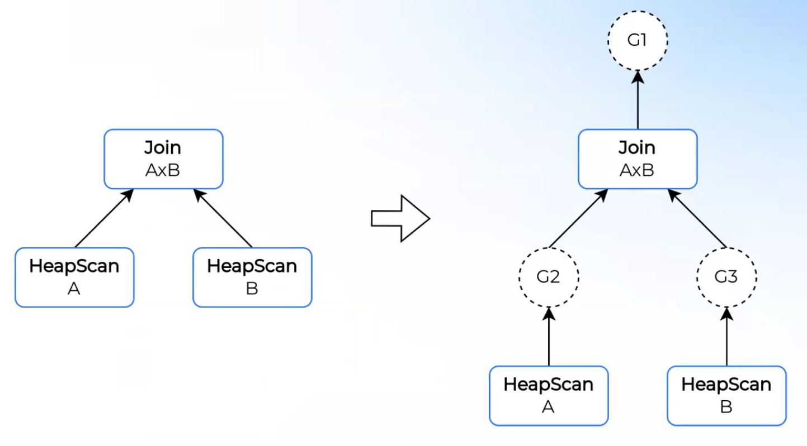
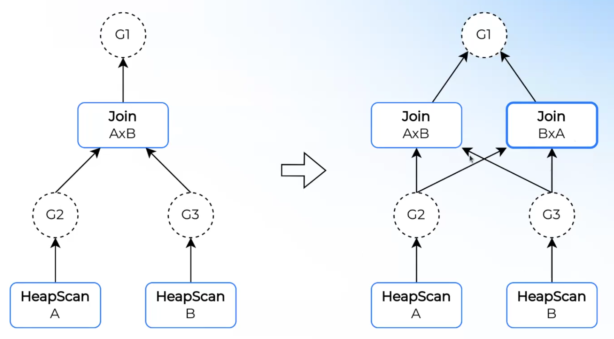
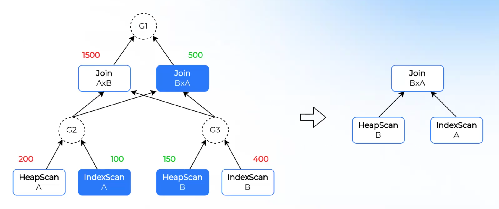

# Лекция 3. Способы трансформации в оптимизаторе

### Задача оптимизации
В статьях зачастую задачу оптимизации описывают вроде "оптимизация планирования `Join`-ов". На практике же задача оптимизатора звучит следующим образом: найти **эквивалентный** физический план с **минимальной стоимостью**.

**Стоимость** плана – величина, которая описывает трудоемкость его выполнения.

**Трансформация** плана – замена текущего плана на эквивалентный. Обычно производится с целью уменьшения стоимости и уточнения алгоритмов выполнения конкретных операторов.

**Оптимизация** – последовательность трансформаций плана.

### Паттерн `Visitor`.
Позволяет обходить деревья в заданном порядке (сверху-вниз, снизу-вверх). Помимо классического визитора, можно также аргументом прокидывать контекст, который будет хранить более полную информацию. Считается самым гибким способом, на нем можно реализовать любую трансформацию. Но у него есть и минусы: требует написания большого количества вспомогательного кода, если нужно учитывать контекст. Также может быть достаточно большой оверхед, т.к. в случае изменения дерева придется, помимо прохода от корня к листьям, заменять узлы при проходе от листьев к корню. Зачастую используется для небольшого количества сложных оптимизаций.
Примером преобразования, реализуемым с помощью визитора, может быть `Filter Push Down`: 
```SQL
SELECT *
FROM t1 INNER JOIN t2 ON ...
WHERE t1.x = 1;
```
План без преобразований выглядит следующим образом:
```SQL
Filter[t1.x = 1]
  Join[...]
    Scan[t1]
    Scan[t2]
```
Для `Join`-а полезно, чтобы его входные отношения были как можно меньше. Фильтр на аттрибут одной из таблиц можно сделать сразу же, как только можно, тогда в `Join` будут переданы таблицы меньшего размера. Итоговый план может выглядеть следующим образом:
```SQL
Join[...]
  Filter[t1.x = 1]
    Scan[t1]
  Scan[t2]
```
Стоит заметить, что эта оптимизация не локальна: между `Join`-ом и `Filter`-ом может быть множество промежуточных узлов и оптимизация все равно имела бы место.

### Rule-based
Правило – изолированная, локальная трансформация, которую оптимизатор применяет к отдельной части плана в соответствии с паттерном. Правило состоит из паттерна, для которого оно применимо, и логики того, как из контекста создавать новый узел. 
```Java
class Rule {
    Pattern getPattern();
    PlanNode apply(Context ctx);
}
```
Паттерн – это логика сопоставления части плана с заданным правилом. Такой вид трансформации обеспечивает модульность и минимизирует количество сопровождающего кода, что упрощает тестирование. Главный минус: позволяет реализовать только простые трансформации, для которых достаточно ограниченного контекста. Также необходим драйвер – код, который сопоставляет паттерны с деревом плана и вызывает функцию трансформации.
Пример: оптимизация проекции на `Scan`.
```SQL
SELECT a, b+c
FROM t
```
Наивный план выглядит следующим образом:
```SQL
Projection[a, b+c]
  Scan[a, b, c, d, e, ...]
```
В случае колоночных БД мы, очевидно, читаем поколоночно, поэтому разумно было бы в `Scan` передавать только необходимые в дальнейшем атрибуты. Для проекции нам нужно только атрибуты `a`, `b`, и `c`. И тогда оптимизированный план мог бы выглядеть следующим образом:
```SQL
Projection[a, b+c]
  Scan[a, b, c]
```
Часто под `Rule`-ами подразумевают просто строго описанные оптимизации, поскольку у Oracle-а был четкий и ясный порядок выполняемых оптимизаций, оттуда это и пошло. В современном мире под `Rule`-ами подразумевают именно модульную локальную организацию.

Для того, чтобы `Rule`-ы работали, нужен драйвер. Он работает примерно следующим образом:
* Обходится некоторая структура данных (дерево или же MEMO, о котором будет дальше).
* Для текущего узла драйвер смотрит в некоторую таблицу с правилами для поиска таких правил, у которых верхний оператор совпадает с типом текущего узла.
* Для каждого подходящего правила смотрим, какие типы и структуру дочерних узлов оно ожидает, и проверяем детей текущего узла.
* Если все совпало, то вызываем функцию трансформации.

### Итеративные драйверы
У драйвера может быть стратегия применения правил. Во-первых, бывают **итеративные** драйверы: те, у которых в любой момент времени ровно 1 план и как только драйвер может применить трансформацию, он ее производит. Есть два основных подхода к итеративным драйверам: снизу вверх и сверху вниз, у этих подходов разная семантика и в зависимости от подхода итоговый план будет отличаться. У таких драйверов могут быть проблемы с зацикливанием, у Apache Calcite иногда встречается. Обычно интерфейс выглядит следующим образом: итеративный драйвер получает на вход набор правил, для каждого из которых указано, каким подходом обходить дерево; драйвер будет поочередно брать правило и в соответствии с его порядком обхода будет обходить план.

На практике можно столкнуться с проблемой следующего характера: допустим, есть дерево операторов:
```SQL
A
  B
    C
```
И драйвер заменяет `C` на `C1`. Тогда нам необходимо будет изменить ссылку на дочерний элемент у узла `B`. Однако, во многих оптимизаторах используются немутабельные деревья, тогда пришлось бы полностью заново конструировать дерево, что достаточно ресурсо-затратно. Для этого используется следующая конструкция: драйвер перед началом оптимизаций добавлять на нечетные уровни суррогатные узлы, называемые **группами**, у которых всегда ровно один ребенок, на который хранится мутабельная ссылка. В драйвер зашита логика пропуска вот таких групповых узлов, а при изменение реальных узлов, драйвер будет изменять ссылки у суррогатных. В конце применения `Rule`-ов, оптимизатор удалит все групповые узлы и пересоздаст единожды все реальные узлы, чтобы поправить ссылки.
Пример:
```
           G1         G1
             A          A
    A          G2         G2         A1
      B    ->    B    ->    B    ->    B1
        C          G3         G3         C1
                     C          C1
```
Основное преимущество итеративных драйверов состоит в том, что они простые и прямолинейные. Однако, иногда бывают ситуации, когда не понятно, применение правила улучшит или ухудшит план. Для таких правил нужна мемоизация.

### MEMO
Представим, что есть правило, которое прокидывает фильтр под агрегацию:
```SQL
Filter       ->  Aggregate1
  Aggregate        Filter1
```
Если фильтр селективен и убирает большую часть строк, то такая оптимизация полезна. Но если фильтр не селективен и почти не убирает никаких строк. Тогда такая оптимизация может быть вредной, посколько после агрегации фильтр мог бы читать меньшее количество строк.

Хочется иметь структуру, которая одновременно поддерживает большое количество планов, из которой мы по итогу хотим выбрать наилучший. Для этого использутся структура **MEMO** и cost-based оптимизации на ней.

Структура MEMO (в контексте оптимизации планов) – граф, который состоит из двух типов вершин: реальных узлов плана и узлов-групп эквивалентности. При этом, входы реальных узлов – это узлы-группы эквивалентности, а входы узлов-групп эквивалентности – реальные узлы.


При добавлении нового узла в план, необходимо проставить нужные входные группы эквивалентность и на выход проставить нужную группу эквивалентности. На примере, допустим, мы хотим изменить `Join[AxB]`, так, чтобы он слева имел `HeapScan[B]`, а справа `HeapScan[A]`. Нужные `Scan`-ы находятся в группах эквивалентности `G3` и `G2` соответственно, "соединяем" со входом в наш новый узел. Узел `Join[AxB]` находится в группе эквивалентности `G1`, поэтому соединяем наш новый узел со входом в узел `G1`. В итоге получается вот такая структура:

Если узел уже есть в структуре, то добавлять его не нужно. Это поможет избежать зацикливания, которое возможно в итеративных драйверах.

В MEMO для каждого можно определить стоимость. Для листовых узлов – на основе статистик, для промежуточных – так же статистики, только еще учитываются дочерние узлы. Такие узлы по построению являются узлами-группами эквивалентности.
Функция рассчета стоимости промежуточных узлов аддитивно, т.е. она равна собственной стоимости, рассчитаной с помощью статистик, а также сумме стоимостей детей.

Стоимость узла-группы эквивалентности рассчитывается как минимальная из стоимости детей. Чтобы сформировать оптимальный план, идем рекурсивно сверху вниз по МЕМО, выбирая на каждом этапе узел с наименьшей стоимостью.

