# Лекция 4. Конкретные оптимизации

### Структура оптимизаций
Прежде чем начать оптимизацию, оптимизатор зачастую предпринимает некоторые подготовительные действия, приводит план к некоторому каноническому виду. Такой процесс называется **нормализацией** плана. Зачастую нормализация идет вперемешку с оптимизацией: для разных оптимизаций могут быть нужны разные представления плана. Оптимизацией, например, может быть последовательность правил с итреативным драйвером, или какая-то cost-based оптимизация. Последовательность таких шагов ("программ" в терминах Apache Calcite) обычно захардкожена прямо в движке.
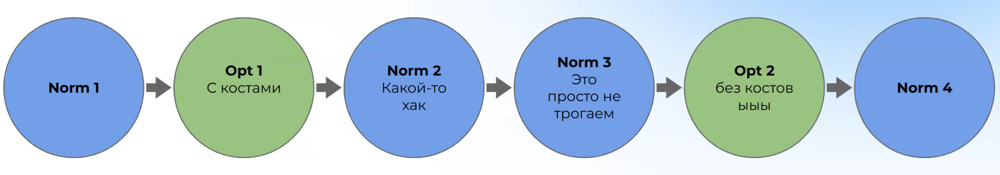

### Нормализация и упрощение выражений
Рассмотрим пример:
```SQL
SELECT a + b, b + a + 2 + 1
```
Понятно, что `a + b == b + a` всегда и выражение `2 + 1 == 3` вычислимо на этапе оптимизатора. Пример того, как можно нормализовать, упростить план:
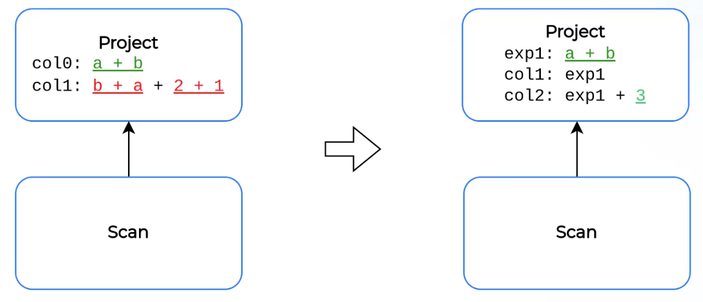
Нормализация также применяется для того, чтобы сравнивать узлы плана на эквивалентность и искать общие подпланы. Такая трансформация достаточно затратна, она сравнива с исполнением всего плана, для этого требуется какой-то вычислитель. Например, в Apache Calcite есть класс `RexSimplify`, который под капотом использует кодогенерацию и Java Reflection.

Встречается также трансформация одних операторов в другие, которые семантически эквивалентны:
```SQL
YEAR(c_date) = 2024
```
трансформируется в 
```SQL
c_date BETWEEN '01/01/2024' AND '31/12/2024'
```
Зачем может понадобится такая трансформация: если по атрибуту `date` построен сортированный  индекс(в OLTP системе), то в случае с `BETWEEN` можно бинарным поиском найти нужный диапазон, без линейного сканирования. А в исходном сниппете оптимизатор видит просто вызов функции, которая не предполагает поиск по диапазону. Польза может быть и в случае OLAP систем: данные зачастую партиционируются по датам, в таком случае исполнение `BETWEEN` просканирует только необходимые партиции. Оптимизаций такого рода много, например, если есть `LIKE`, который сопоставляет по префиксу, то можно так же трансформировать в меньше/больше.

### Filter into Join
Есть SQL запрос:
```SQL
SELECT ...
FROM a JOIN b
WHERE a.a1 = b.b1
  AND a.a2 = 100
```
Если смотреть на тривиальный план, то тут написан `Cross Join`, поверх которого есть фильтр. Понятно, что на самом деле тут имели в виду `Inner Join` с условием `ON a.a1 = b.b1`. Для того, чтобы сделать такую оптимизацию, необходимо "пропихнуть" предикат фильтра в `Join`.
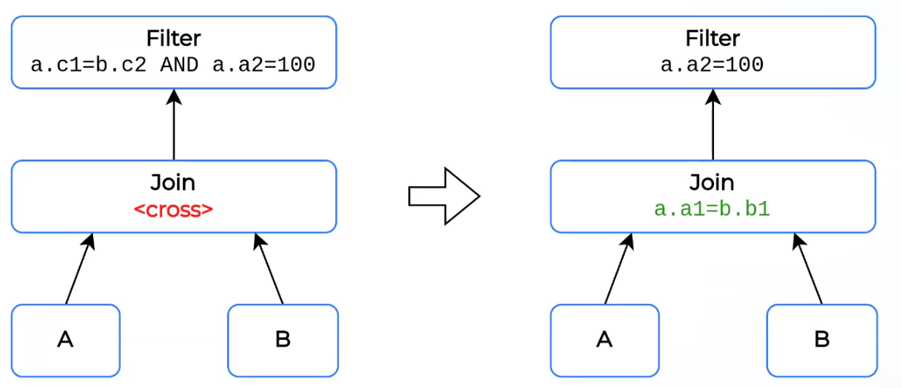


### OutterJoin into InnerJoin
Рассмотрим следующий запрос:
```SQL
SELECT ...
FROM a LEFT OUTER JOIN b
  ON a.a1 = b.b1
WHERE b.b1 > 100
```
`Left Outer Join` производит кортеж, у которого справа (значения атрибутов таблицы `b`) могут быть `NULL`.
Однако, поверх `Join`-а происходит фильтрация по предикату `b.b1 > 100`, и строки, у которых все значения атрибутов таблицы `b` являются `NULL`-ами, такую фильтрацию не пройдут. Информацию об этом необходимо "пропихнуть" в `Join`. Зная эту информацию, можно делать более простой `Inner Join`.
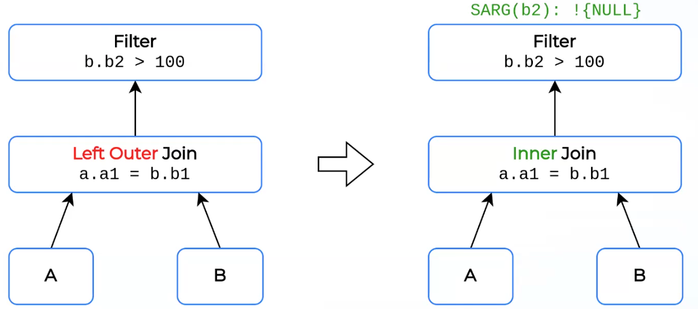

### Упрощение агрегатов
Рассмотрим запрос:
```SQL
SELECT pk, SUM(a)
FROM tf
GROUP BY pk -- pk is primary key
```
Группировка по первичному ключу (уникальному ключу в общем смысле, это можно получить из метаданных) не имеет смысла, в таких случаях агрегат ничего не агрегирует. Его можно заменить на более простой оператор. Вместо `SUM(a)` будет просто значение атрибута `a`, возможно, с приведением типа. Такая оптимизация есть в Apache Calcite: `AgregateRemove`.
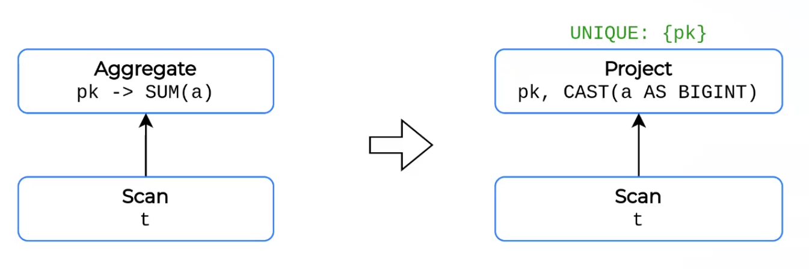

### Distinct Aggregate to Join
Бывают ситуации, когда движок **не умеет** выполнять определенный операции. В этом случае можно попробовать переписать неподдерживаемые операции на эквивалентные.
Расмотрим такой запрос:
```SQL
SELECT
   a,
   SUM (DISTINCT b),
   SUM (DISTINCT c),
FROM t
GROUP BY a
```
Мы хотим сгруппировать по `a`, и для каждой группы просуммировать уникальные значения `b` и `c`. Получается такая агрегация внутри агрегации, не очень понятно как выполнять. Можно преобразовать в агрегацию по `[a, b]`, `[a, c]`, просуммировать по `b`, `c` и затем соединить получившиеся таблицы по аттрибуту `a`, ключу исходной агрегации.
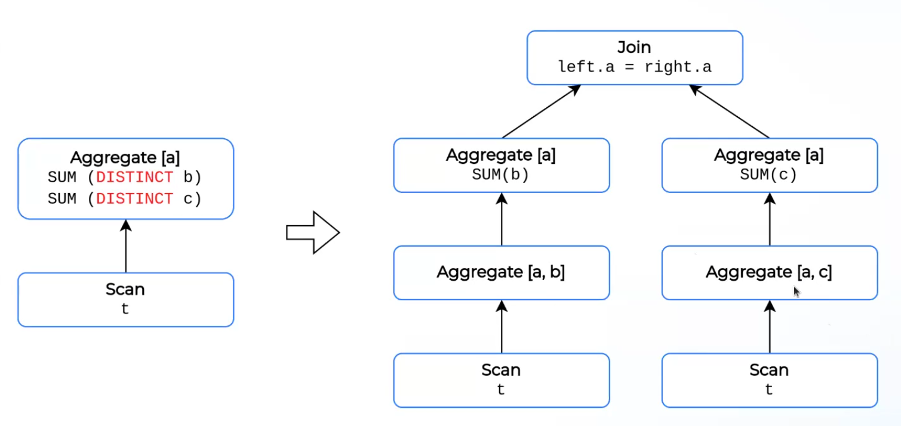

<!-- TODO про Intersect to UnionAll + Aggregate -->

### Переписывание подзапросов
Бывают такие подзапросы, которые используют какую-то информацию из внешних запросов. Такие подзапросы назвыают **коррелированными**. Пример такого запроса:
```SQL
SELECT
  s.name,
  e.course
FROM students s -- s is outter info
  INNER JOIN exams e ON s.id = e.sid
WHERE e.grade = (
  SELECT MAX(e2.grade)
  FROM exams e2
  WHERE e2.sid = s.id -- uses s.id that is outter info
)
```
Выводит для каждого ученика список экзаменов, на которых он получил свою максимальную оценку. В общем случае можно сделать с `Nested Loop Join`: для каждого ученика пришлось бы выполнять данный подзапрос, что ресурсо-затратно.
Недавно вышла статья [Unnesting Arbitrary Queries](https://cs.emis.de/LNI/Proceedings/Proceedings241/383.pdf), в которой доказывается, что любой  запрос с коррелированным подзапросом может быть переписан без коррелированного подзапроса и многие современные движки имлементировали этот алгоритм. Некоторые, более старые движки, реализовали некоторые частные случае таких преобразований. Если никакое преобразование не подходит, то движки просто сигнализируют о том, что не могут выполнить запрос.

В итоге исходный запрос эквивалентен следующему:
```SQL
SELECT
  s.name,
  e.course,
FROM students s
  INNER JOIN exams e ON s.id = e.sid 
  INNER JOIN (
    SELECT
      e2.sid inner_sid,
      MAX(e2.grade) inner_max_grade
    FROM exams e2
    GROUP BY e2.sid
  ) ON s.id = inner_sid
WHERE e.grade = inner_max_grade;
```

### Уменьшение количества выполняемых операций
Оптимизации, направленные на то, чтобы обрабатывать как можно меньшее количество строк.

### Filter PushDown
Уже затрагивался на одной из предыдущих лекций. Цель в том, чтобы "спустить" фильтр как можно ближе к сканированию, чтобы обрабатывать меньшее количество строк в промежуточных операторах. Правда, если фильтр неселективен, то может стать хуже. Идеальное решение – добавление этой оптимизации в cost-based фазу. На практике `Filter PushDown` чаще делают безусловно.
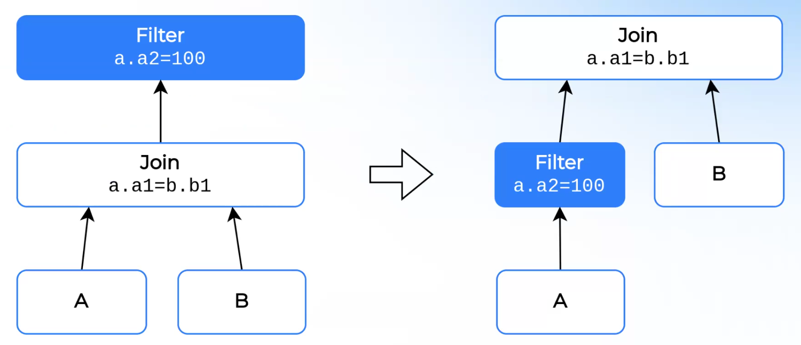 

### Filter PullUp
Иногда имеет смысл поднимать фильтры наверх.
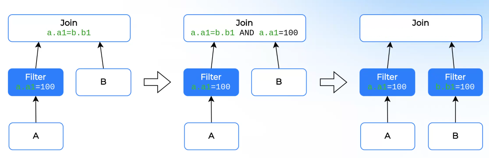
* Поднимаем фильтр `a.a1=100` в `Join`.
* В `Join` видим, что есть предикат `a.a1 = b.b1`, и при этом `a.a1 = 100`. Значит, `b.b1 = 100`
* Опускаем фильтр в правый вход `Join`-а.
* Итого нам в `Join` вообще не нужен предикат

### Dynamic Filters
Есть оптимизации, которые осуществляются в рантайме, но при этом требуют подготовки оптимизатора. Рассмотрим пример:
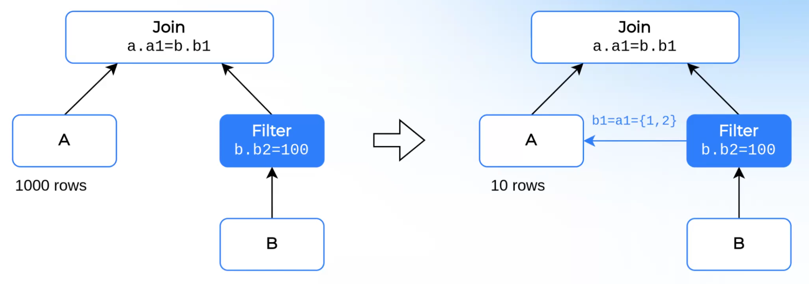
Допустим, таблица `A` содержит много записей, а таблица `B` после фильтрации  по предикату `B.b2 = 100` имет NDV = 2 для столбца `b1`. Из `Join`-а сверху видим, что в итоговом отношении верен предикат `a.a1 = b.b1`, и хочется как-то этот предикат в рантайме опустить в `Scan A`. Тогда оптимизатор делает заготовку для этого: говорит движку, что `Scan B` и `Filter[b.b2=100]` надо выполнить **до** сканирования таблицы `A`, и после сканирования `A` можно применить предикат из `a.a1 IN {1, 2}`, посколько все возможные значения `b.b1` известны (и равны `{1, 2}` в данном примере).

### Spool
Вместо дерева можно хранить ацикличный DAG, заменяя одинаковые подпланы. После первого выполнения плана можно сохранить результаты на диске, **spool**-ить их. Плюсы: требуется меньшее количество вычислений. Проблемы, с которыми придется столкнуться: может стать хуже из-за потери параллелизма, риск взаимных блокировок, как пропушивать различные фильтры сверху. Пример:
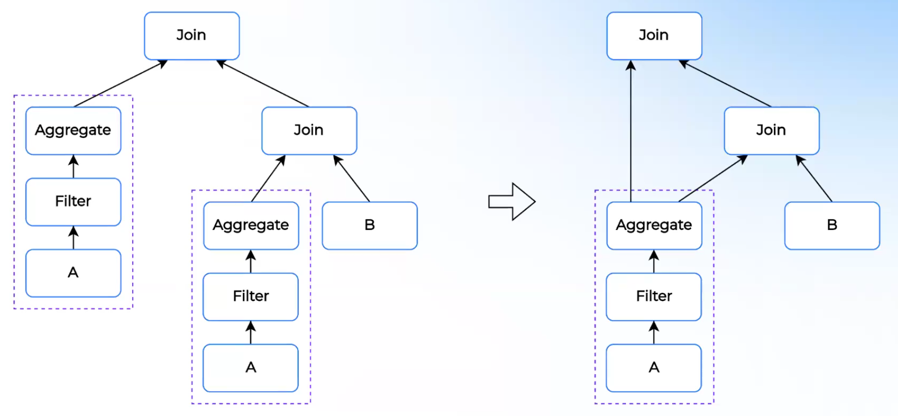

Такая оптимизация мало где реализована, из известных движков – Greenplum.

### Materialized views
Идея следующая: давайте посмотрим, какие подзапросы чаще всегда пользователи отправляют в оптимизатор, среди частых выберем те, которые почти не меняются от запроса к запросу, и будем записывать кэшировать на диске. Пример: в сети магазинов все транзакции сохраняются в OLTP БД, раз в сутки сгружаются в одну большую аналитическую БД, на которой аналитики что-то считают. Зачастую, аналитиков интересует только записи за последний день. Поскольку в аналитическую запись происходит раз в сутки, то мы можем сохранять все записи за предыдущий день отдельно, **материализованное представление**.
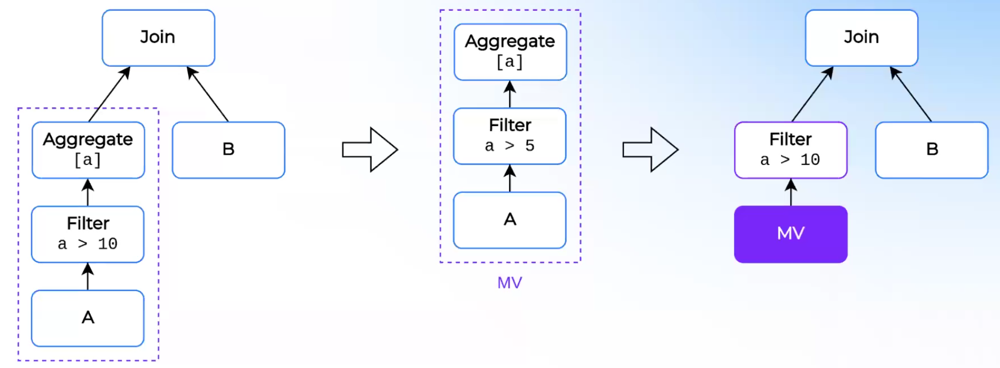

Возникает две задачи, и обе NP-сложные:
* Как подобрать оптимальный набор materialized views для заданной нагрузки?
* Как переписать дерево операторов плана на materized views?

Обычно используются жадные полиномиальные алгоритмы, использующие решётки (lattice).
