# Лекция 5. Планирование порядка Join-ов
Зачастую, просто под оптимизациями в БД подразумевают оптимизации `Join`-ов, хотя это неверно.

### Проблема
Рассмотрим следующий запрос:
```SQL
SELECT 
  lineitem.*
FROM customer -- таблица пользователей
  JOIN orders ON c_custkey = o_custkey -- таблица заказов
  JOIN lineitem ON o_orderkey = l_orderkey -- таблица заказанных единиц товаров
WHERE
  c_name = 'Ivanov' -- предикат на таблицу customer
```
Можно соединять сначала `customer` с `orders`(`C` и `O`) и потом е результату добавлять `lineitem`(`L`), а можно сначала соединять `O` и `L`. Предположим, что всего 150'000 пользователей, 1'500'000 заказов и 6'000'000 заказанных единиц товаров. Рассмотрим эти две стратегии:
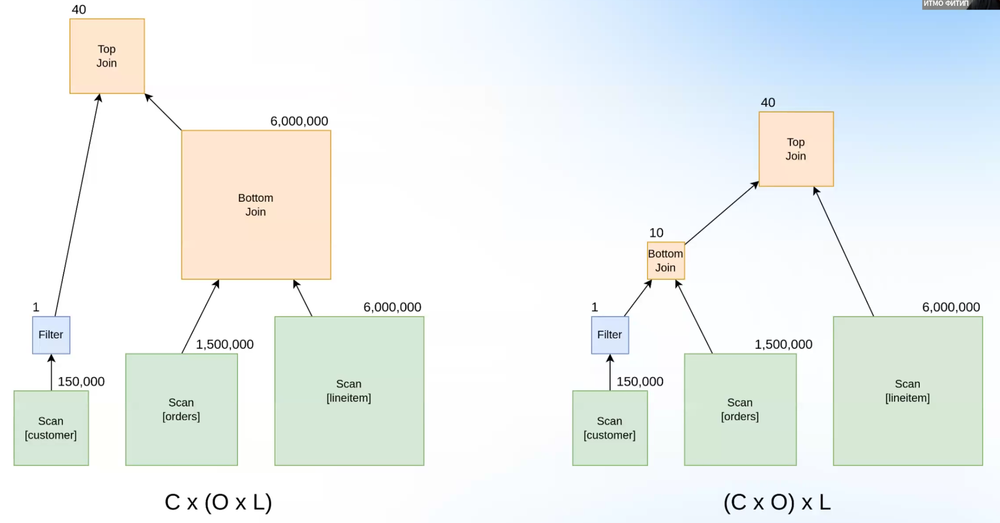
Видно, что в случае, когда сначала соединяются `O` и `L`, тратится больше памяти, и, очевидно, CPU. Поэтому выгоднее все-таки сначала соединять `C` и `O`. Иногда разница во времени выполнения бывает колоссальной: секунды против часов.

### Алгоритмическая сложность
Выбор наиболее оптимального порядка `Join`-ов – сложная задача. Можно оценить количество всех возможных вариантов.

Предположим, что структура дерева зафиксирована. Тогда нужно распределить `N` таблиц по `N` местам, это в точности `N!` вариантов.
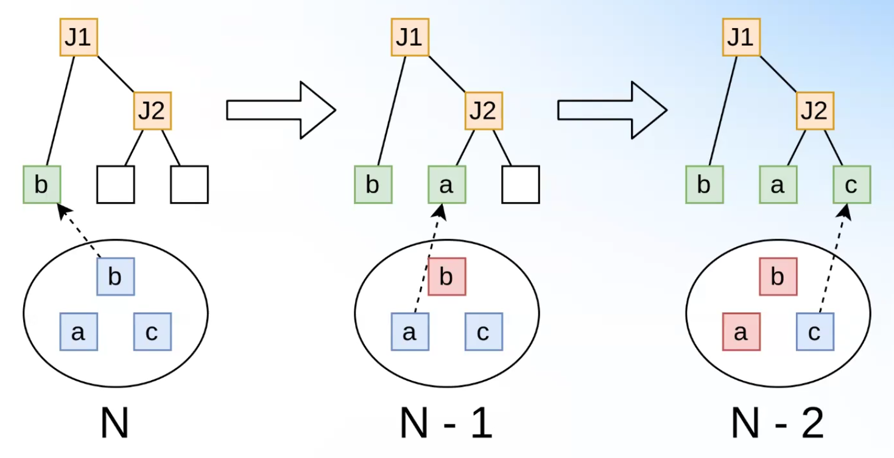

Предположим теперь, что структура дерева не зафиксирована, а порядок таблиц зафиксирован. То есть нужно найти количество неизоморфных (разных по структуре) бинарных деревьев с корнем и `N` листьями. Это в точности `C`<sub>`N-1`</sub> – `N-1`-ое число Каталан. Оно равно `(2N - 2)! / (N! (N - 1)!)`.

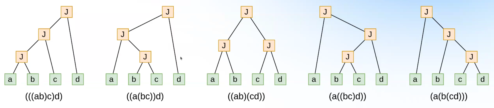

Итоговое количество возможных вариантов `Join`-ов равно `N! * (2N - 2)! / (N! (N - 1)!) = (2N - 2)! / (N - 1)!`. Это экспоненциальная функция:
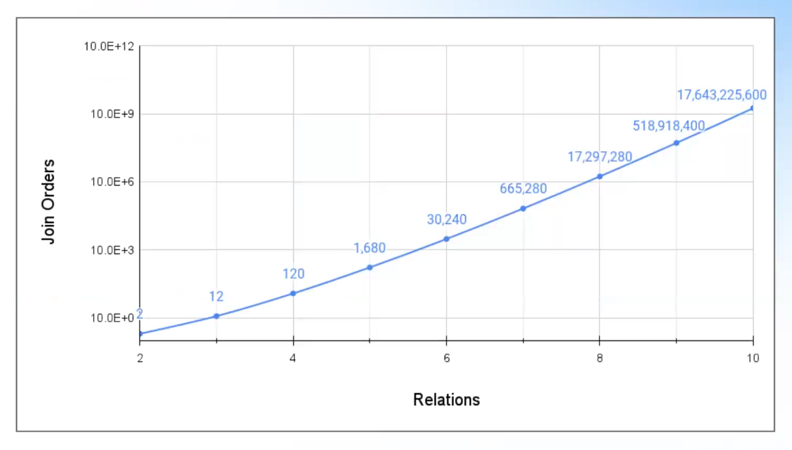

Для транзакционных систем количество `Join`-ов зачастую не очень большое, единицы. Для аналитических – вплоть до сотни, в таком случае делать полный перебор невозможно. Такой запрос, требующий большого  количество `Join`-ов таблицов, может быть сформирован каким-то скриптом. Иногда суммарное количество таблиц в БД доходит и до миллионов.

### Топологии
Грубый перебор не возможен, нужно что-то хитрее. Первая идея: если две таблицы не связаны каким-то предикатом друг с другом, то соединять их в первую очередь смысла нет (это `CrossJoin`). Расширяя эту идею, мы приходим к анализу топологии связей:
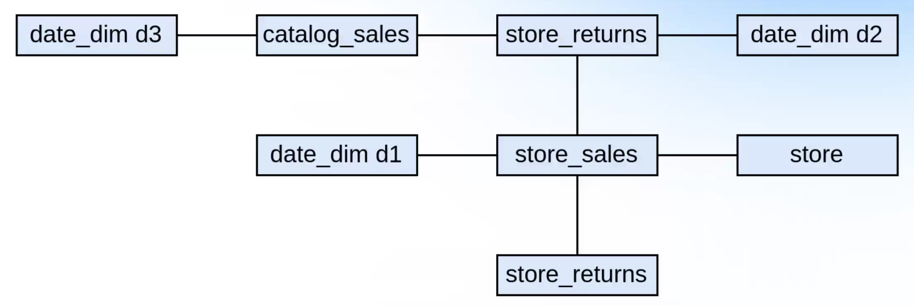
Узел здесь – таблица, а связь – наличие условия между таблицами. Здесь, например, соединять `store` и `date_dim d3` особо смысла нет. 

Всего основных видов топлогии 3:
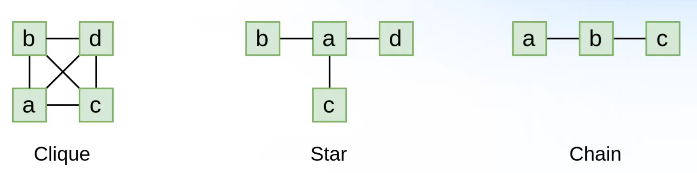

**Клика** – полный граф.

**Звезда** – все узлы, кроме одного, соединены с единственной вершиной.

**Цепочка** – граф бамбук.

Посмотрим для различных топологий, сколько различных вариантов порядка `Join`-ов без учета `CrossJoin`-ов существует.
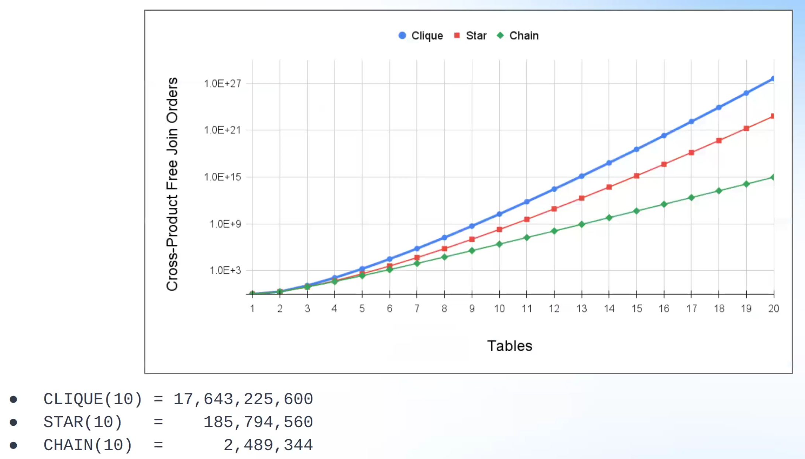

Шкала `Y` логарифмическая. Видно, что для количества таблиц `N = 10` для звезды на два порядка меньше возможных вариантов, для цеопчки еще на 2 порядка меньше. Даже для топологии "цепочка" понятно, что грубо перебирать все возможные варианты не представляется возможным. 

### Решение методом динамического программирования
Найти оптимальное решение можно с помощью динамического программирования. Идея как в MEMO: для каждого класса эквивалентности найдем оптимальный порядок `Join`-ов, а потом будем эти знания переиспользовать, переход от отншений, состоящих из соединения маленького числа таблиц, к отношениям, состоящим из большого числа таблиц.

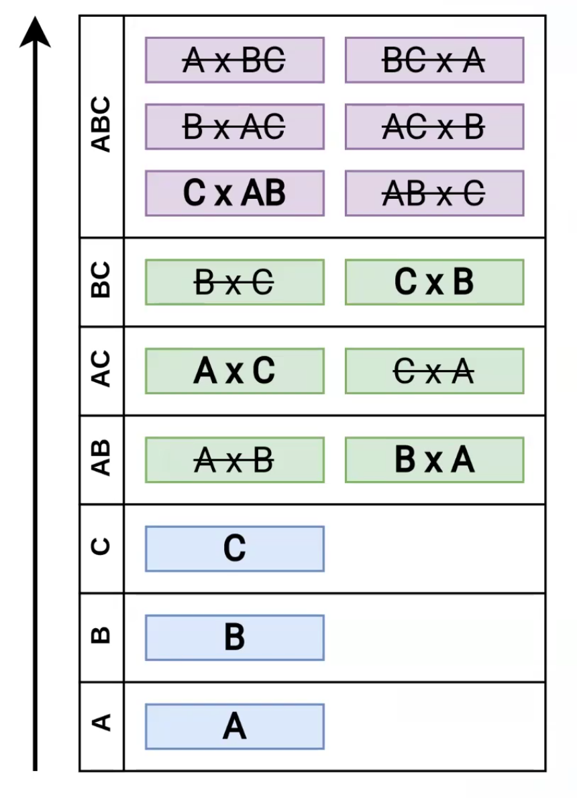
Например, в классе эквивалентности `ABC` оптимальным вариантом является `C x AB`.
Под `AB` тут подразумевается класс эквивалентности `AB`, из таблицы видно, что это `B x A`.

Такая структура используется в алгоритме `DPSize`:
```C++
for (int i = 2; i <= N; i++) { // размер группы
  for (int j = 1; j < i; j++) { // размер одной из подгрупп
    // генерация всех подгрупп размера j
    List<Group> leftGroups = generateGroups(j);

    // генерация всех подгрупп размера i-j
    List<Group> rightGroups = generateGroups(i - j);

    for (left : leftGroups, right : rightGroups) {
      counter++;
      if (connected(left, right) && // не является CrossJoin
          not_intersecting(left, right)) { // избежать Join[AB x A]
        connected_counter++;
        Cost leftCost = DP[left].cost;
        Cost rightCost = DP[right].cost;

        // leftGroup=[AB], rightGroup=[C], group[ABC]
        Group group = combine(left, right);

        auto order, cost = createNewOrder(group, leftCost, rightCost);
        if (cost < DP[group].cost) {
          DP[group] = {order, cost};
        }
      }
    }
  }
}
```
Рассматриваемый порядок: `A`, `B`, `C`, `AB`, `AC`, `BC`, `ABC`.
Хорошо работает для разреженных графов, типа цепочки.

Похожим образом устроен алгоритм `DPSub`: 
```C++
// маска подмножества из N таблиц
for (int mask = 1; mask < (1 << N); mask++) {
  Group group = genFromMask(mask); // маска -> группа
  List<group> leftGroups = generateSubGroups(group); // все подгруппы
  for (leftGroup : leftGroups) {
    counter++;

    // комплементарная группа
    Group rightGroup = complement(group, leftGroup);
    if (connected(leftGroup, rightGroup)) { // не является CrossJoin
      connectedCounter++;
      Cost leftCost = DP[left].cost;
      Cost rightCost = DP[right].cost;

      // [left x right] vs [right x left]
      order, cost = findBestOrder(group, leftCost, rightCost);
      if (cost < DP[group].cost) {
        DP[group] = {order, cost};
      }
    }
  }
}
```
Этот алгоритм более подходящий для графов с большим количество ребер, типа клики. Порядок обхода: `A`, `B`, `AB`, `C`, `AC`, `BC`, `ABC`.

Бывают еще схожие алгоритмы, основанные на идеи динамического программирования, например DPHyp.

Основные проблемы такого подхода:
* Фундаментально, задача является NP-полной
* Задача эффективного алгоритма ДП заключается в том, что уменьшать значение `counter`, делая его максимально близким к `connectedCounter`.
* Обход идет снизу вверх, что не позволяет учитывать свойства для выбора физических имплементация
* Не позволяет делает **prunning** – отбрасывание заведомо плохих планов.

### Top-Down алгоритмы
Идея следующая: давайте рассматривать сначала крупные планы, а потом подпланы. 
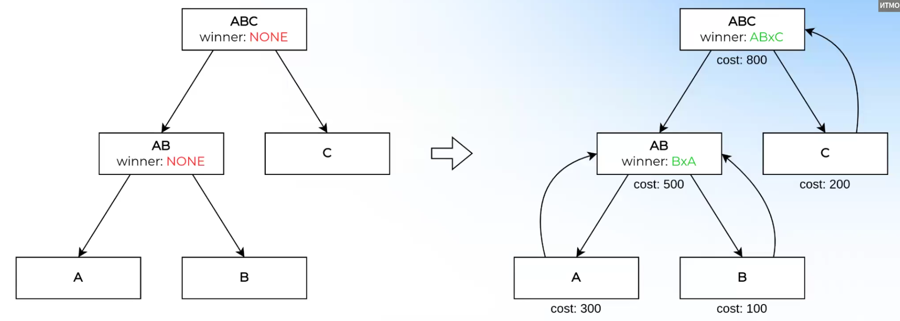

Предположим, что мы умеем строить какой-то план за стоимость `X` (придется перебрать какое-то множество маленьких подпланов, но оно будет небольшое).
Тогда, используя эту информацию, при спуске в подпланы, мы можем заранее отбрасывать планы, которые заведомо будут стоить `> X` (prunning).

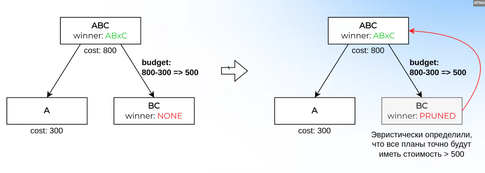
На этом примере мы каким-то образом (важно, что алгоритмически не очень сложным) определили, что порядок `AB x C` имеет стоимость 800. `Scan[A]` стоит 300. Тогда, если стоимость `BC` больше 500, то такую подгруппу даже рассматривать бесполезно. Например, если мы знаем что `Scan[B]` стоит 400, а `Scan[C]` стоит 200. 

Такой подход реализован мало где, потому что сложно понять и сложно реализовывать какой-то агрессивный prunning. Вроде бы используется в Microsoft SQL Server.

### Планирование с помощью правил
Описать планирование `Join`-ов можно с помощью правил. Достаточно ввести два правила:
* CommuteRule: `Join[AxB] -> Join[BxA]`
* AssociateRule: `Join[Join[AxB] x C] -> Join[A x Join[BxC]]`

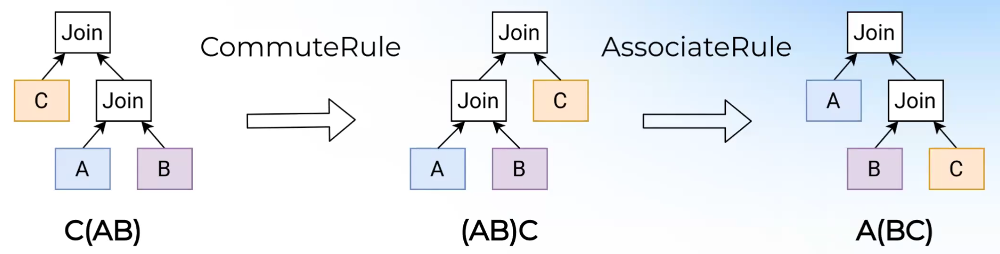
Преимущества: можно использовать готовую инфраструктуру для пременений правил с MEMO.
Недостатки: приводит к генерации повторяющихся планов, что сильно замедляет планирование. 

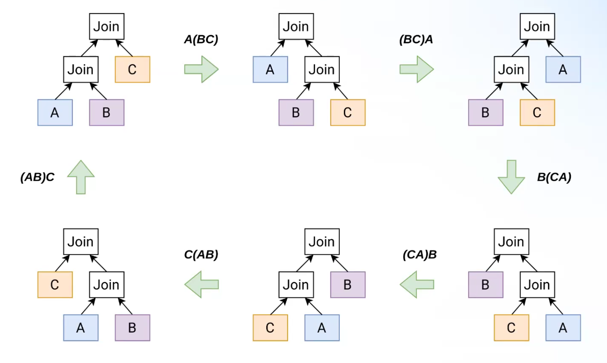
Применяется для простых планов с небольшим кол-вом `Join`-ов.


Итого: есть 3 основные альтернативы для алгоритма планирования `Join`-ов: ДП, Top-Down и правила. Обычно выбирают какой-то из алгоритмов ДП, т.к. они проще и достаточно эффективны. При этом, вычислительная сложность во всех алгоритмах экспоненциальная.

### Неоптимальный план.
На самом деле, не всегда нужен самый оптимальный план, а просто достаточно хороший. 

Идея заключается в следующем: давайте разобьем план на небольшие подпланы, в каждом подплане рекурсивно решим задачу, а потом соединим оптимальные подпланы.
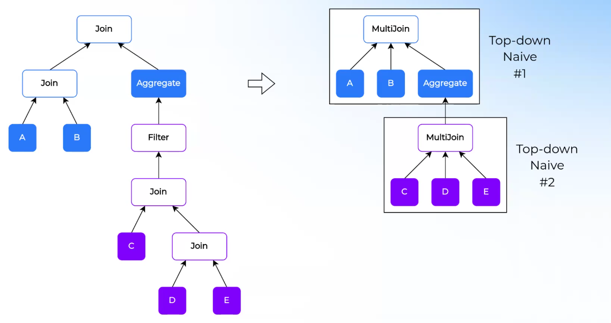

Понятно, что оптимального решения так не найти, но оно будет в какой-то степени хорошим. Например, так делает Trino: делит на подпланы `Join`-ов, решает маленькие подзадачи методом Top-Down, а потом соединяет все вместе.

Вспомним график роста всех вариантов порядка `Join`-ов.

Допустим, в плане есть 8 `Join`-ов. Всего вариантов примерно 17'000'000. Но если разбить на два подплана по 4, то получим `120 * 120 = 14400` вариантов, что на 3 порядка меньше.

В Apache Calcite используется жадный алгоритм, который работает за `O(n^2)`, при этом он очень далек от оптимального решения, зато работает очень быстро.

Самое главное для оптимизатора – обпеспечить **плавную** деградацию производительности при увеличении количества `Join`-ов. Если всегда использовать жадный алгоритм, то для маленьких планов будет очень плохой план, хотя ресурсы позволяют выбрать самый оптимальный план. Если всегда использовать точные алгоритмы, то при увеличении кол-ва `Join`-ов оптимизатор будет зависать, выедать всю память и т.д., хотя мог бы просто отдавать не самый оптимальный план, тут важно уметь балансировать.
