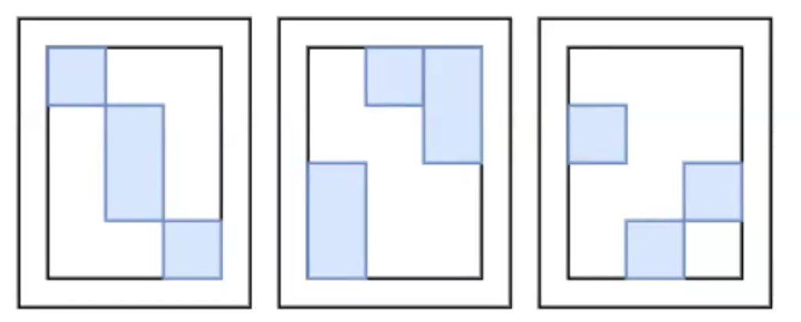

# Лекция 6. Общее про исполнение операторов

Есть два способа организовать передачу данных от одного оператора к другому.

### Pull модель – данные запрашиваются потребителем
Исторически первая модель, впервые представлена в статье [The Volcano Optimizer Generator](https://15721.courses.cs.cmu.edu/spring2023/papers/16-optimizer1/graefe-icde1993.pdf). Так назвыаемая **Volcano Iterator Model**. Каждый оператор представлен в виде итератора:
```Java
interface Operator {
    Optional<Row> nextRow(); // returns empty if there are no rows left
}
```
Внутренняя структура оператора может выглядеть следующим образом:
```Java
class SomeOperator implements Operator {
    private Operator child; // or List<Operator> children;
    @Override
    Optional<Row> nextRow() {
        var row = child.nextRow();
        // some logic with children
        return row;
    }
}
```
Схема использования:

Плюсы: легко строить дерево, всё так же визитором; для пользователя очень простой интерфейс, просто вызов `nextRow()` верхнего оператора и дальше все заработает по цепочке.

Минусы: высокие накладные расходы на возврат одной строчки, как минимум 1 виртуальный вызов. Можно передавать сразу список строк(блок, страница):
```Java
interface Operator {
    Optional<List<Row>> nextRow(); // returns empty if there are no rows left
}
```
Ещё минусы:
* Повторение кода: каждый оператор должен написать код, который в цикле запрашивает строки, обрабатывает ошибки и т.п.
* Невозможность прервать получение следующей строки
* Недетерминированное время получения строки (например, если есть низкоселективный фильтр) в цепочке
* Сложно распараллеливать выполнение оператора
* Непонятно, как работать с общими подпланами
* Непонятно, как работать с асинхронным IO

DuckDB перешли по итогу ушли с Pull модели на Push, описав причины в [issue](https://github.com/duckdb/duckdb/issues/1583).

### Push модель – передавать данные оператору выше сразу, как только они доступны
Push модель похожа на event loop: есть некоторый драйвер, который занимается общение компонент (операторов), и есть компоненты (операторы), которые дожидаются событий и сами их создают:

В такой модели оператор выглядит следующим образом:
```Java
interface Operator {
    void addInput(List<Row> rows);
    boolean needsInput();

    Optional<List<Row>> getOutput();
    Future<void> isBlocked();
    boolean isFinished();
}
```

Метод `addInput()` понятно зачем нужен. Может показаться, что метод `needsInput()` всегда должен возвращать `true`, но это не так. Например, оператор `Join` можно отдавать больше строк, чем получил на вход, и пока `Join` не обработал все входные строки, ему не обязательно нужны новые.

Метод `getOutput()` тоже понятно зачем нужен. `isFinished()` используется для операторов типа `LIMIT`, когда известно, что на выход ничего больше не будет добавлено, а входных строк еще много.

`Future<?> isBlocked()` нужен для работы с IO: если после добавления входных строк драйвер, через вызов этого метода, видит, что оператор заблокирован на какой-то операции (чтение с диска или сетевого хранилища), то драйвер отложит исполнение этого оператора и подпишется на то, когда закончится блокирующая операция и продолжит исполнение данного оператора.

В такой модели удобен параллелизм, так как логика управления потоков исполнения вынесена из операторов. При этом, появляется необходимость в **расписании**: кооперативное выполнение нескольких запросов, зависимость между участками плана. Например, если в `HashJoin` не построили хэш-таблицу по одному из входных отношений, то не имеет смысла выполнять операторы другого входного отношения, пока таблица не готова.

Из предыдущего примера вытекает простая классификация всех операторов:
1) **Streaming** операторы – закинули в них батч, получили сразу же что-то на выход.
Пример:
* `SortAggregate`
* `Filter`
* `Projection`
* `Union All`

2) **Blocking** операторы – должные обработать все входные данные прежде, чем выдать первую строку. Пример: 
* `HashAggregate`
* `Sort`
* Некоторые оконные функции
<!-- TODO что-то не очень понятное про Monet DB -->

Интереснее с `HashJoin`. Он состоит из двух частей: `HashBuild` – построение хэш-таблицы на основе одного из входных отношений, и `HashProbe` – перебор строк из второго отношения с поиском по хэш-таблице из шага `HashBuild`. Натуральным образом получается, что `HashBuild` - блокирующий, а `HashProbe` – стриминговый. При этом, создается естественная зависимость `HashProbe` от `HashJoin`. 


Когда появляется разделение на блокирующие и стриминговые операторы, кажется естественным разделение всего плана на **пайплайны** – наборы операторов, которые состоят из неблокирующий операторов, заканчивающихся блокирующим. При этом между такими пайплайнами могут быть связи. Пайплайн является единицей исполнения, т.к. пока не встретится блокирующий оператор, мы можем продолжать исполнение без остановок. Пример пайплайна:


Самым простым способом составить **расписание** является просто топологическая сортировка пайплайнов.

### Параллелизм операторов
Современные машины, особенно серверные, имеют много ядер, поэтому важно использовать параллелизм в движках. Дальнейшее будет исходить из двух предположений:
1) Каждый оператор имеет доступ к разделяемому пулу потоков
2) Стоимость переключения потока меньше, чем стоимость обработки одного пакета данных

Например, можно распараллелить сортировку:

* Делим все данные на `N` равных частей
* Рекурсивно сортируем каждую часть
* Рекурсивно сливаем каждую часть, пока не сольем в одно

Заметим, что на каждом последующем этапе слияния используется в 2 раза меньше потоков, чем на предыдущем; последнее слияния делает только один поток.

Так же можно реализовать `HashAggregate`: разбиваем все строки на `N` частей, каждую часть обрабатывает один поток, затем все сливается в одну хэш-таблицу.

### Параллелизм данных
Паралеллизма по данных можно достичь засчет файлов: различные структурные единицы могут лежать по разным файлам. Также можно иметь структуру внутри файлов: хранить хедер в начале файла, из которого можно вычленять нужный offset для искомой структурной единицы.

Заметим, что нельзя просто так распараллелиться по различным структурным единицам, чтобы каждый поток читал свой независимый кусок данных и выполнял свой пайплайн:

В примере данные о `Mary` находятся в двух файлах, поэтому необходима дополнительная логика для синхронизации получившихся таблиц. Для этого оптимизатор необходимые операторы. На самом деле, файлы могут находиться не только локально, но и на удаленных машинах, и там возникает похожая проблема.

### Распределение данных
Данные хранятся обычно согласно какому-то паттерну, распределению:
* **Партиционированно(partitioned)**. Данные распределены на непересекающиеся части, каждая часть обладает каким-то интересным свойством, например, в ней хранятся данные за один день. Или хэш от даты, если хочется ограничить количиство партиций. Если для агрегатов используется тот же ключ (атрибут), что и для партиционирования, то все записи для одного ключа лежат в одной партиции. 

* **Случайно(random)**. Нельзя сделать никаких выводов о свойствах. Обычно фиксированное, достаточно большое количество партиций.

* **Реплицированно(replicated)**. Каждый узел содержит полную копию данных. Требуется избыточная емкость, зато больше надежность и параллелизм.


### Оператор `Exchange`
TODO
<!-- 
1) Идея в том, чтобы перед агрегатом насыщать план информацией о локальности данных. Чтобы был параллелизм и не было проблемы, как в одном из примеров выше
2) Пример с hash aggregate. Сканируем таблицы, партиционируем по ключу агрегации. Выбираем нужную параллелизацию
3) С сортировками: Out узел на самом деле занимается слиянием результатов с узлов.
4) Есть важная задача, как планировать выполнение операторов на узлы.
-->
