# Лекция 7. Исполнение конкретных операторов

### Сканирование
Оптимизация сканирования основана на двух предпосылках:
* Чем меньше мы читаем, тем лучше
* Доступ к метаданным существенно дешевле, чем чтение самих данных (хотя метаданные бывают большие)
Представим, что у нас есть следующие метаданные оператора:
```SQL
Scan Table = T1
Columns = [C2, C1, C4]
Filters = [C2 >= 0, C1 = 'abc']
```

Первая оптмизация характерна для колоночного хранения: все колонки хранятся отдельно, поэтому можно читать только то, что необходимо, в данном случае только колонки `C1`, `C2`, `C4`, используя метаданные хранилища:
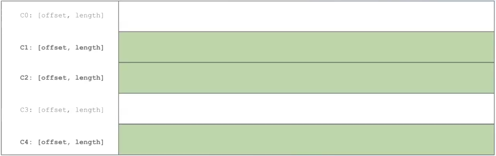

Вторая оптимизация заключается в использовании статистик. У нас есть фильтр `C2 >= 0`. Если у нас для каждого блока, хранящего часть колонки `C2`, сохранен максимум, то те части, у которых максимум меньше 0, мы можем пропускать. По итогу число чтений может уменьшиться.
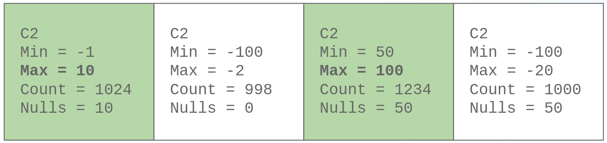
Зелёным помечены те куски, которые будут прочитаны.
Стоит заметить, что необходимо последующая дофильтрация для первой страницы, посколько там `Min = -1`, значит не все элементы из этой страницы нам подойдут.

Третья оптимизация состоит в использовании вероятностных структур данных, например, фильтр Блума. Хорошо работает для равномерно распределенных данных, плохо работает с timestamp-ами. Фильтр Блума очень компактен, можно хранить в метаданных страницы. 
В данном случае применяется для предиката `C1 = 'abc'`:
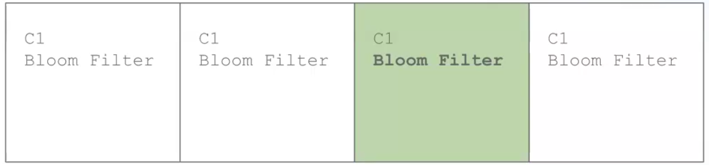

### Организация хранилища данных
В Clickhouse используется **разреженный индекс (sparse index)**. В Clickhouse  данные внутри хранятся отсортированными, распределены по блокам, примерно по 8192. Есть дополнительный файл, который хранит в себе крайние значения каждого блока и указатель на сам блок данных. Таким образом, во время `RangeScan`-а можно сразу пропускать по 8192 элементов, или вообще использовать бинпоиск. Таким образом, размер этого индекса (**файла засечек** в терминах Clickhouse) почти на 4 порядка меньше, чем размер исходного файла. 
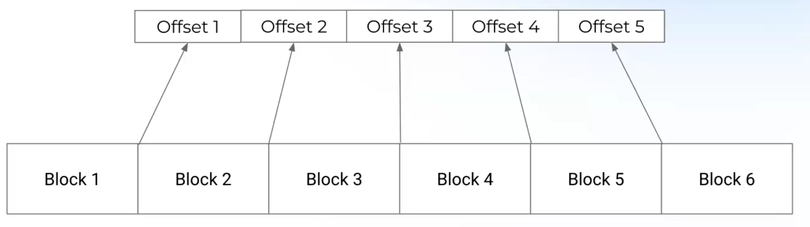

В Snowflake используется подход, когда каждый блок отсортирован внутри себя, и при этом начала всех блоков отсортировано. Значение атрибута может лежать в нескольких блоках.
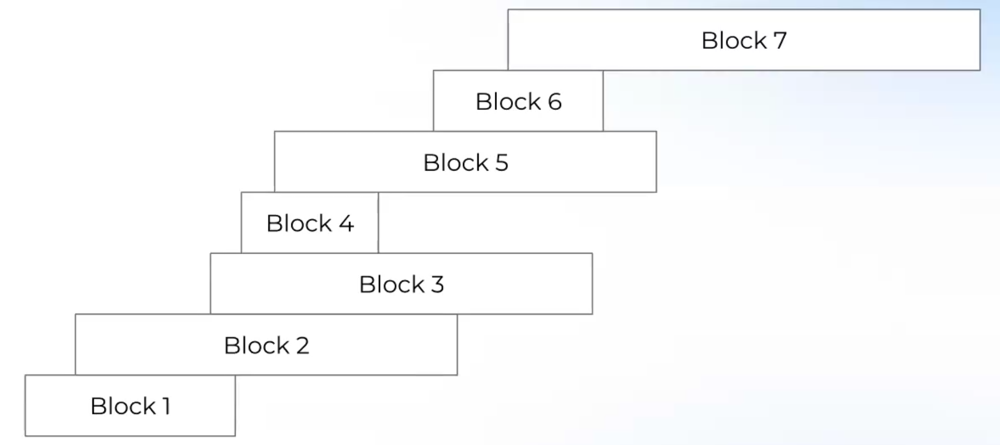
Все так же удобно итерироваться, пропуская сразу большие блоки данных (минимумы и максимумы блоков можно поддерживать). При этом, удобно мержить соседние блоки в один для того, чтобы подать на вход в вышестоящий оператор.

Бывает также **metadata-only scan**, например, если у нас **точный** подсчет статистики `COUNT`, и в запросы хотим посчитать `count(c1)` без каких-то фильтров, то можно на него ответить вообще не читая данных из таблицы.

### Вычисление row expressions
Можно вычислять прямолинейно, как есть:
```Java
interface Expression {
    Object evaluate(Row row);
}

class BiFunnctionCall implements Expression {
    // ...
    Object evaluate(Row row) {
        var v1 = arg1.evaluate(row);
        var v2 = arg2.evaluate(row);
        return func.apply(v1, v2);
    }
}
```
У такого подхода есть минусы:
1) Boxing значений, проверка типов, виртуальные вызовы.
2) Неоптимальный layout памяти и, как следствие, неэффективное использование кэша процессора. Допустим, нам нужны для вычисления только первые 4 колонки из 8, то в случае построчного хранения получится большое количество промахов по кэшу. 

Первый способ улучшить производительность – использовать **векторизированные вычисления** (**не** SIMD). Идея состоит в том, чтобы обрабатывать массивы фиксированного типа одной и той же операцией. Это улучшает кэш-локальность и способствует векторизации машинного кода:

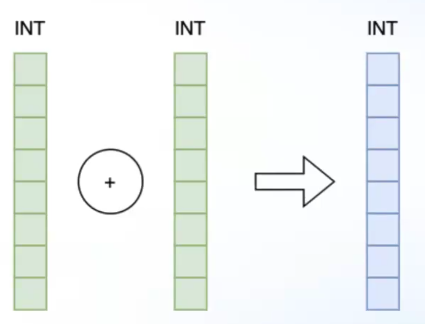

Чтобы избежать boxing-а типов, можно определить специальные типы данных, которые могут компактно и без боксинга хранить вектор `Int`-ов, `TinyInt`-ов и т.д. Для каждой пары таких типов можем сделать конкретную невиртуальную функцию (в терминах Apache Arrow называется **kernel**-ом):

```Java
Int32Array sum_int32_int32_not_null(Int32Array left, Int32Array right) {
    check(left.size() == right.size());
    var result = new Int32Array(left.size());
    for (int i = 0; i < left.size(); i++) {
        result.append(
            left.intValue(i) // без boxing-а и виртуального вызова
            + // без виртуального вызова
            right.intValue(i)); // без boxing-а и виртуального вызова
    }
}
```

Важно, что `not_null`, иначе пришлось бы в цикл добавлять `if`, что плохо может сказаться на префетчинг.

Есть на вход поступают вектора разных типов, то есть два подхода: либо оптимизатор делает `implicit cast` к наиболее общему типу, либо это придется обрабатывать в рантайме.

Рассмотрим пример:
```SQL
SELECT a + b + c - d FROM table
```
Здесь нужно несколько промежуточных векторов:
```
a + b = tmp1_vec
tmp1_vec + c = tmp2_vec
tmp2_vec - d = result_vec
```
От них можно избавиться, например, создав пул возможных векторов заранее. Однако, если типы векторов в выражениях меняются, то возникают сложности. Чтобы избавиться от временных векторов, можно попробовать сделать кернел для 4 аргументов: если 5 стандартных типов и 4 арифметических оператора, то всегдо 5^4 * 4^3  =  +- 40000 различных функций. Можно использовать кодогенерацию, но, тем не менее, рано или поздно упремся в размер бинарного файла. Можно компилировать на лету, используя **JIT** компиляцию.

### Вычисление дорогих предикатов
Предикаты бывают разные и очень сложные. Они могут использовать различные сложные функции: `preg_match`, `day_of_week`, простые условия типа `a < 0`. Так же там встречаются `AND`, `OR`, которые **не являются short-circuit**, что открывает дорогу для оптимизаций.

Обычно используется следующий подход: сначала преобразовывается в КНФ (внешние клозы `AND`-ы, а внутренние `OR`-ы). Затем на основе метаданных вычисляются селективности каждого предиката, который не содержит булевых условий. Заметим, что для `AND` предиката выгоднее всего вычислять тот подпредикат, который оставляеть меньше всего записей, а для `OR` – наоборот. В соответствии с этими наблюдениями сортируем предикаты в КНФ форме.

Следующая проблема – высокоселективные фильтры. Если фильтр ничего не отфильтровывает, то страница копируется полностью, что создает нагрузку на аллокатор.

Первый способ решения – использование битмаски:
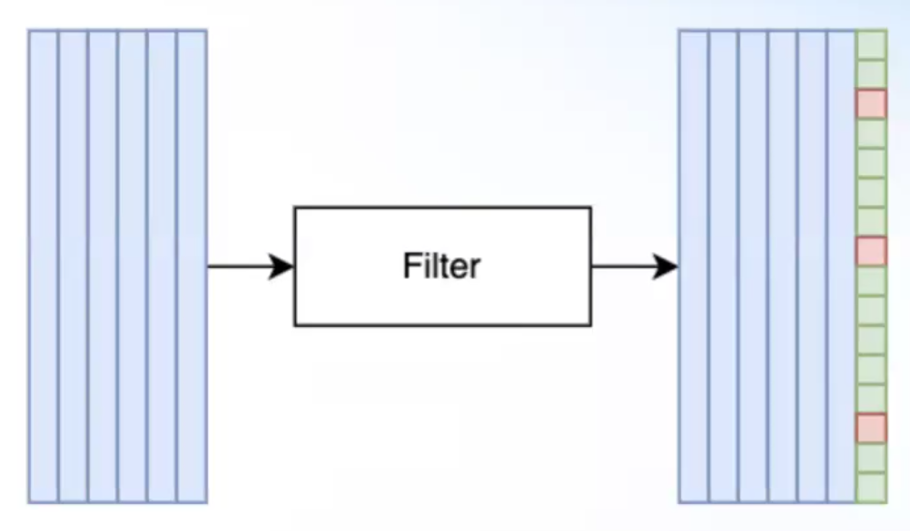
Красным помечены элементы, которые фильтр выкинул. 
Интересно следующее: при использовании страницы с битовой маской нужно ли пропускать отфильтрованные строки или нет? С одной стороны, если над ними производятся затратные вычисления, то да. 
```JAVA
for (int r = 0; r < input.size(); r++) {
    if (bitmask.isSet(r)) {
        // do the EXPENSIVE computation
    }
}
```
Но если вычисления простые, то `if` внутри цикла может оказаться бОльшее влияние на производительность (branch misprediction).
```JAVA
for (int r = 0; r < input.size(); r++) {
    // do the CHEAP computation
}
```

Второй способ – **Selection Vector**. Вместо битовой маски храним вектор индексов, целых чисел, неотброшенных строк.
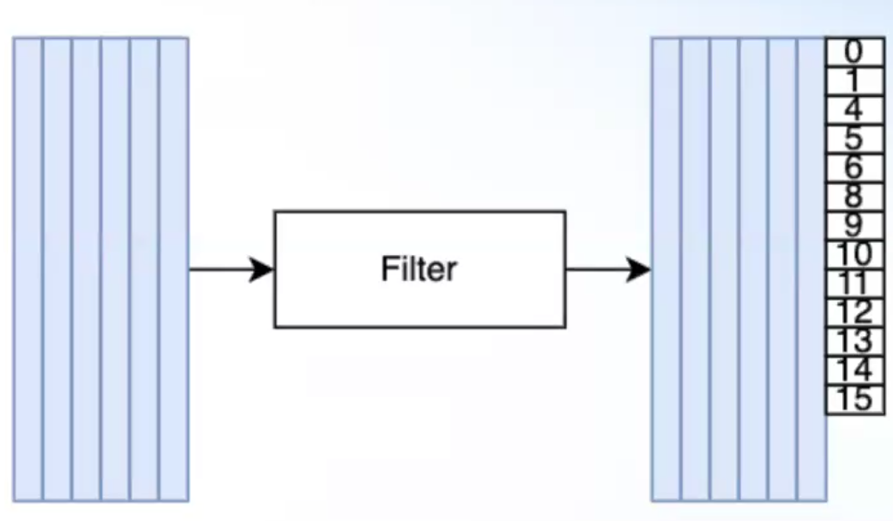
Такой подход требует больше памяти, он как минимум `int16`. Но он помогает избавиться от branch misprediction, итерироваться можно просто по индексам в selection vector-е.

Заметим, что если selection vector очень разреженный, то могут начаться cache miss-ы. Поэтому полезно при каком-то пороге селективности все-таки аллоцировать новую страницу, чтобы не терять производительность на cache-missa-ах. 

Иногда некоторым оператором удобно использовать битовую маску, иногда selection vector, поэтому полезно уметь их конвертировать друг в друга, люди придумали, как это делать быстро в статье [Filter Representation in Vectorized Query Execution](https://db.cs.cmu.edu/papers/2021/ngom-damon2021.pdf).

### Эффективность hash-based операторов
Производительность хэш-таблиц является критически важной для аналитических движков.
* Таблица помещается в кэш – CPU bound задача, упирается в эффективность вычисления хэша.
* Таблица не помещается в кэш – Memory bound задача, упирается в паттерн доступа к памяти.

Как и во всех высокопроизводительных системах, используются хэш-таблицы с открытой адресацией. В хэш-аггрегатах и хэш-присоединениях есть особенность работы с хэш-таблицами: в нее сначала происходят записи, строго после этого происходят чтения, а потом разом происходит удаление всей таблицы, то есть удаления отдельных элементов не происходит.

Основной проблемой в хэш-таблицах является `resize`с реаллокацией, поэтому важно как можно точнее оценивать кардинальность в оптимизаторе, чтобы потом ее использовать для установки изначального размера хэш-таблицы.

Также может быть проблема с тем, что хэш-функция партиционирования совпадает с хэш-функцией построения хэш-таблицы. Тогда могут быть коллизии, что ужасно скажется на производительность. Для этого можно использовать соль или просто использовать другую хэш-функцию.

Имеет смысл частичная агрегация: допустим, система распределенная, и оператор `Exchange` собирает данные с каждой машины и потом как-то их агрегирует. Ключи агрегации на каждой машине могут совпадать. Тем не менее, может быть полезно сагрегировать на каждой машине, чтобы уменьшить кардинальность перед итоговой агрегацией.
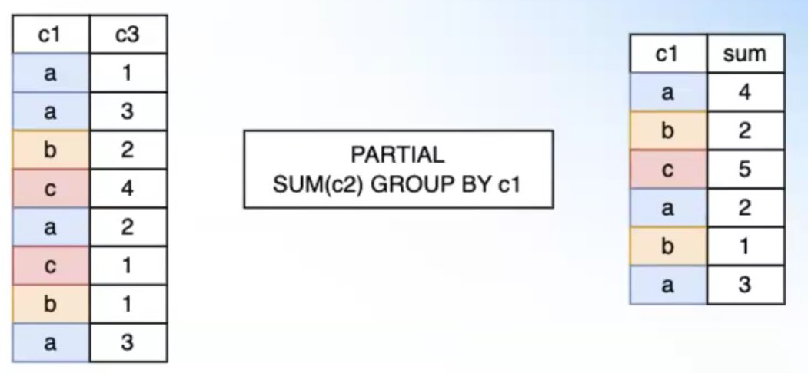
Обычно такая опимизация работает динамически: если в рантайме видим, что частичная агрегация практически ничего не агрегирует, то ее отключают. Также можно делать частичную агрегацию и локально, если ограничена потребляемая память.

Рассмотрим следующий пример:
```SQL
SELECT
  SUM(a),
  MIN(a),
  MAX(a),
  AVG(a),
FROM table
GROUP BY b
```
Наивное решение построило бы для каждого агрегата свою хэш-таблицу, что, очевидно, очень затратно. Проще построить одну хэш-таблицу, в которой подсчитывать сразу 4 аккумулирующие функции. Но такая таблица может вылазить из кэша, поэтому иногда аккумуляторы можно хранить в отдельной области памяти, а в таблице хранить индексы на эту таблицу.
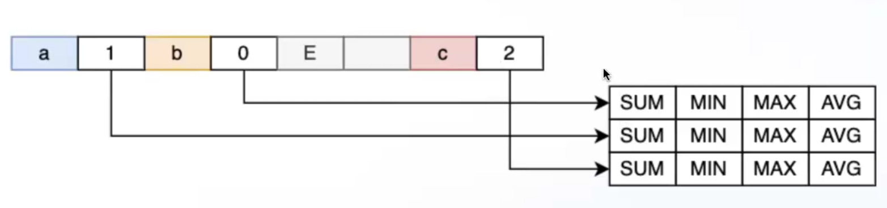
На схеме, видимо, `a`, `b` и `c` – значение атрибута `table.b`. 
Такая система используется в Trino.

`HashJoin` должен уметь хранить в хэш-таблице все строки по конкретному ключу. Для строк заводится некоторое отдельное хранилище, в котором они хранятся. Если по ключу `a` есть строка, то в хэш-таблицу просто храним индекс. Но если по конкретному ключу нужно хранить несколько строк? Можно хранить ссылку на список с индексами строк, заведя для такого в значении хэш-таблицы специальный бит.
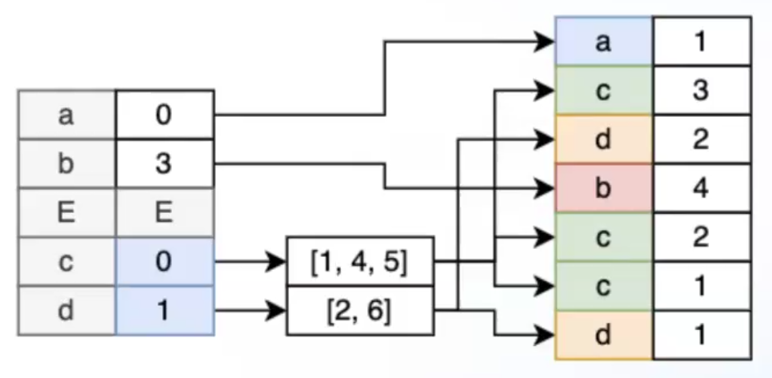

Одна из проблем производительности при использовании хэш-таблиц является время деаллокации аллоцированных структур, лишняя нагрузка на CPU. Для этого используют арены, чтобы за константное время деаллоцировать всю использованную память.

### Параллельная сортировка
Она уже обсуждалась, но остановились на том, что не умеем делать параллельно фазу merge. Такой алгоритм есть, он занимает `O(n + m)` по памяти и требует, как утверждается, `O(log n)` предобработки. Идея следующая: давайте поделим два массика на `K` частей, так, чтобы все значения из объединения `i`-ых частей **обоих** массивов были строго больше всех значений `i-1`-ых частей и меньше `i+1`-ых. Утверждается, что так всегда сделать можно. Каждую часть, в таком случае, можно merge-ить параллельно, а потом останется просто сконкатенировать. Пример:

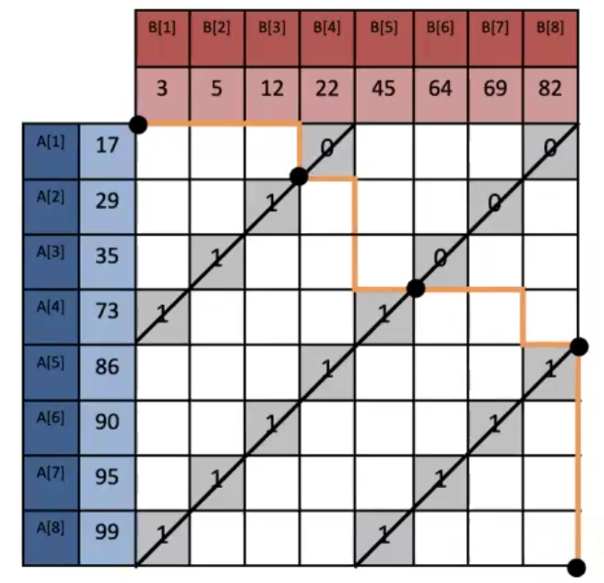

Все это подробно описано в статье [A Visually Intuitive Approach to Parallel Merging](https://arxiv.org/abs/1406.2628)
