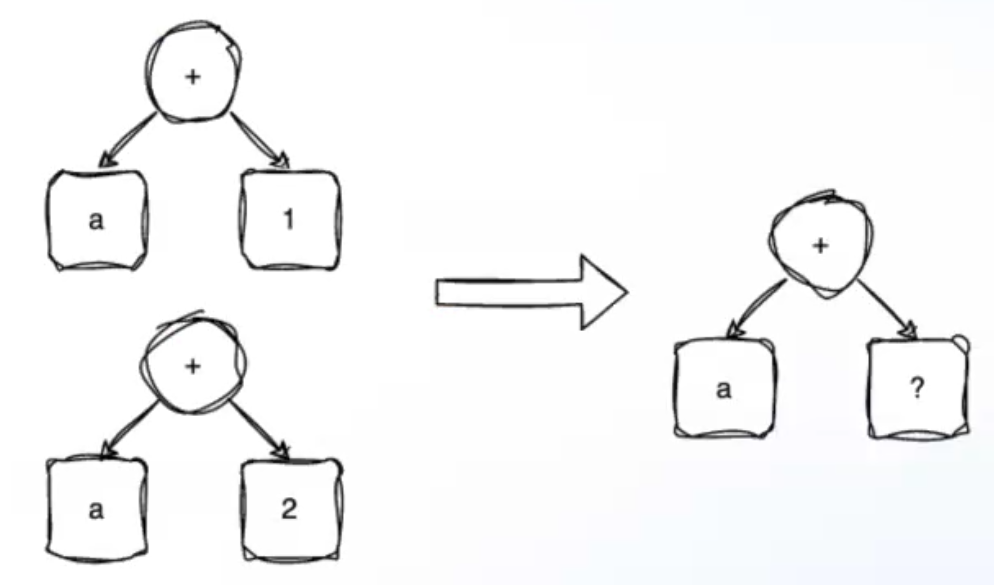
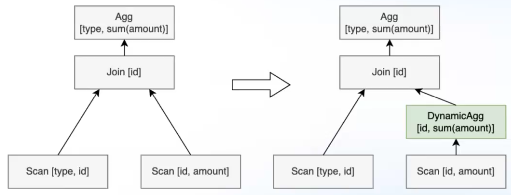
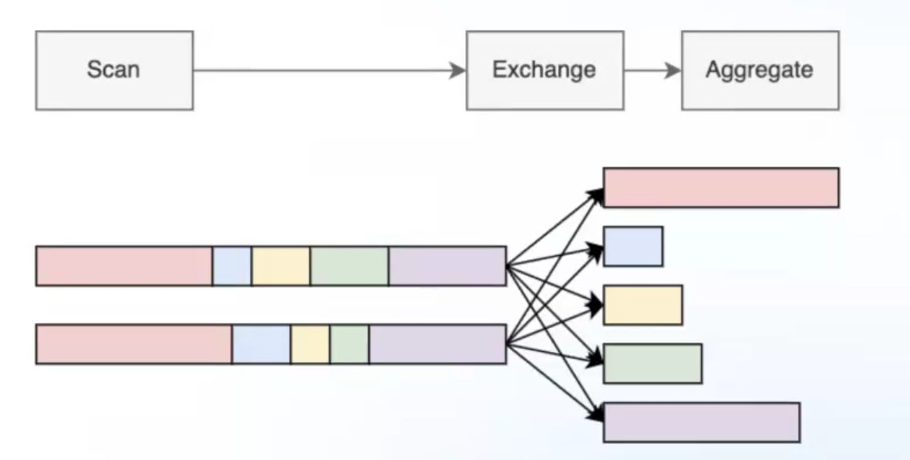
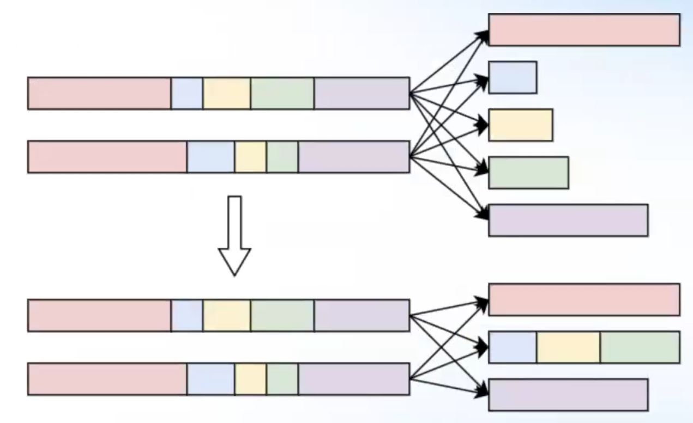
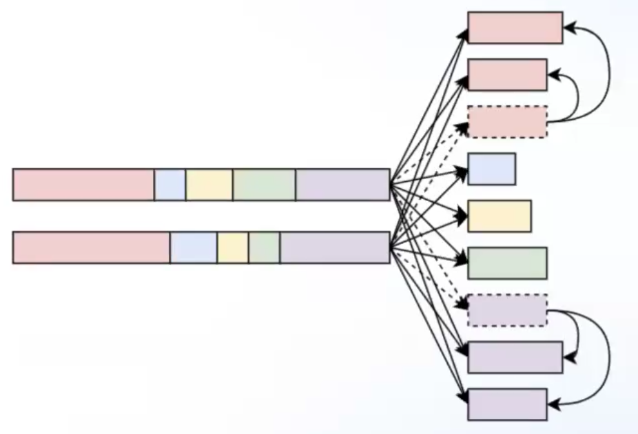
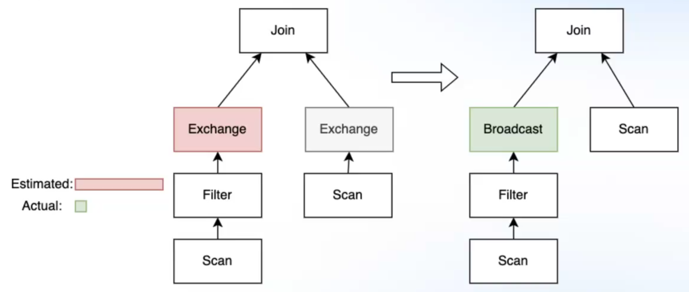

# Лекция 8. JIT, кэши и реоптимизация
**JIT** – выполнение кода, сгенерированного во время исполнения. Во время исполнения у нас есть различная дополнительная информация (например, что столбец не содержит `NULL`-ов), которая недоступна на этапе оптимизации. Такая информация может помочь сгенерировать более оптимальный код.

### Как происходит динамическая компиляция
В нативных окружениях скомпилированный код просто записывается в буфер. Возможно, для страниц памяти, на которых аллоцирован этот буфер, нужно выставит флаг `EXEC`, чтобы разрешить исполнение. Затем этот буффер можно скастить к указателю на функцию, или напрямую передать управление с помощью ассемблерных инструкций.

В управляемых рантаймах(Java, C#) все несколько сложнее. Машинный код там недоступен (по модулю JNI), можно использовать только инструкции виртуальной машины. Для этого есть специальные инструменты, которые позволяют динамически подгружать код (Java: `ClassLoader.defineClass()`, `Assembly.load()`).

### Возможности JIT компиляции
* Избавление от ветвлений. Например, реализация фильтра часто содержит проверку на `NULL` некоторых атрибутов, такая проверка происходит для каждой строки. Представим, что мы знаем во время выполнения, что конкретный атрибут не хранит `NULL`-ы, соответственно, можно избавиться от ветвления. Мы могли бы использовать кернелы и заранее скомпилировать их, но такое пришлось бы делать для всех типов, всех аргументов, что сильно поспособствовало бы распухание исполняемого файла. Поэтому тут уудобно использовать JIT.
* Избавление от boxing-а объектов. Например, функция реализована для полиморфного типа `Integer`, а мы знаем, что в рантайме`int32`, то можно за счет JIT-а избавиться от виртуального вызова.
* Избавление от таблиц поиска. Например, есть таблица, которая диспетчеризирует вызов функции в зависимости, например, от типа атрибута.
* Можно убирать заведомо недостижимый код. Это сделает код более компактным.

### Подходы к JIT компиляции

**Транспиляция** – генерируем человеко-читаемый код, используем "классический" компиляторный тулчейн, например gcc или javac. Плюсы: легко отлаживать, быстро имплементируется начальная версия. Минусы: долгая компиляция, т.к. будет токенизация, парсинг, все фазы оптимизации и т.п.

**Генерация низкоуровневых структур** – генерация машинного кода (например, сразу ELF-файл) или какого-то Intermediate Representation-а для последующей компиляции (например, LLVM IR). Плюсы: быстрая компиляция, полный контроль над генерируемым кодом. Минусы: необходимо работать с IR, это сложно и требует глубокого погружения в документацию; тяжело отлаживать; высокие накладные расходы на начальную имплементацию.

Есть еще промежуточный вариант, использующийся в проекте Trino, когда генерация происходит в байткоде Java. 


### Примеры использования JIT
##### Filter/Projection
Рассмотрим пример:
```SQL
SELECT a + b + c - d
FROM t
WHERE a > 0 AND b > 0 AND c > 0 AND d IS NOT NULL;
```
Из предиката фильтра знаем, что все аттрибуты не `NULL`, также в рантайме знаем типы всех атрибутов. Можем избавится от промежуточных материализаций. Пример кодгена:
```C++
for (auto row : batch) {
    int32_t a = c0.value(row);
    int32_t b = c1.value(row);
    int32_t c = c2.value(row);
    int32_t d = c3.value(row);
    
    auto res = a + b + c - d;

    out0.append(res);
}
```
Компилятор может хорошо векторизовать такой код (использовать SIMD инструкции).

##### Hash Aggregate

JIT также может быть полезен для хэш-агрегатов. **В общем случае** ключ агрегации может быть любой структуры и в хэш-таблице, будет лежать указатель на эту структуру, а не сама структура, что добавляет 1 уровень косвенности. Помимо этого, для вычисления хэша и вызова функции сравнения потребуется виртуальный вызов.

Однако, с JIT компиляцией можно все упростить:
```C++
struct GroupingKey {
    int32_t c;
    int32_t d;
    int32_t e;

    inline size_t getHash() { ... }
    inline bool equal(GroupingKey other) { ... } 
}
HashTable<GroupingKey> table;
```
Вычислений хэша и сравнение будут заинлайнены, а структура будет размещена прямо в памяти хэш-таблицы, а не в отдельном куске.

##### Сортировка
Одна из главных частей сортировки – функция сравнения строк. В общем случае, она является виртуальной, чтобы быть достаточно общей. В сгенерированной версии можно избавиться от виртуальности и использовать конкретную функцию, которую можно еще и заинлайнить. Это делается, например, в `std::sort` в C++, поскольку эта функция принимает шаблонный компаратор:
```C++
template< class RandomIt, class Compare>
void sort(RandomIt first, RandomIt last, Compare comp);
```

### Latency компиляции
Бывает такое, что время компиляции операторы занимает секунду, а среднее время ответа на запрос – сотня миллисекунд. В таком случае используется следующий подход: при начале обработки запроса начинают компилироваться нужные операторы (выгодно компилировать те, которые обрабатывают много данных), и если запрос еще не до конца обработался к моменту готовности скомпилированного кода, то происходит подмена реализации оператора.

Тут же возникает проблема: некоторые операторы являются `stateful`, например, `Hash Aggregate`. В таком случае можно сериализовать состояние на диск, а в компилируемую версию добавить логику считывания состояния. Заметим, что придется поддерживать две версии оператора: и скомпилированную JIT-ом, и более общую.

Зачастую бывает такое, что некоторые части скомпилированного кода совпадают. Например, сложение конкретного столбца с разными константами. Тогда разумнее параметризовать по литералу, чтобы, например, проекции `a + 2` и `a + 1` использовали одинаковый код:

Также тут поможет нормализация: например, тот же самый код можно использовать для проекций `a + b` и `b + a`.

Также часто скомпилированные куски кода хранят в кэше. Продолжая эту идею, можно хранить кэш не только в in-memory хранилище, но и в персистентном, чтобы в случае перезагрузки узла системы его восстанавливать. Развивая идею дальше, компиляцию можно вынести в отдельный сервис. При этом может возникнуть проблема кросс-компиляции, если машины распределенной системы с разной архитектурой.


### Operator Fusion
В предыдущих лекциях говорилось о том, что операторы объединяются в цепочки, которые заканчиваются блокирующим оператором. Иногда удобно компилировать сразу всю цепочку в виде одной функции вместо того, чтобы делить ее на отдельные операторы. Цель: держать содержимое кортежа в регистрах процессора как можно дольше, избавиться от временных материализаций. Подход с компиляцией всей цепочки называется **Operator Fusion**. 

Рассмотрим, как это могло бы выглядеть. Допустим, есть следующий подплан:
```SQL
Aggregate [<a, b>; count(*)]
  Filter [a > 0]
    Project [a, b]
```
Он мог бы быть скомпилирован следующим образом:
```C++
for (auto row : batch) {
    auto a = c0.value(row);
    if (a > 0) {
        auto b = c1.value(row) + a;
        hash_table[GroupKey(a, b)]++;
    }
}
```
В данном примере избавились от временных материализаций, лучше работа с регистрами процессора, компилятор может оптимальнее скомпилировать такой код. Однако могут быть следующие минусы:

* Уменьшение hit-rate кэша компиляции для сложных запросов
* Ухудшение статистик по операторам, т.к. 
* План не совпадает с физическим: ухудшение статистик, ухудшение отладки и анализа производительности
* **Может** навредить векторизации в случае применения предиката

Обычно для JIT компиляции используются следующие технологии:
* LLVM – платформа для создания различных компиляторов. Подходит как для транспиляции, так и для генерации IR-а.
* ASM (Java) – генератор байткода Java и вспомогательные классы
* Janino – альтернативный компилятор для Java

### Кэширование запросов
Проблематика: часто одни и те же (или **очень** похожие) SQL-запросы повторяются, поэтому хочется как-то кэшировать результат и по возможности отдавать закэшированное значение.

Сразу возникает вопрос: как организовать кэш. Первое, что надо решить – что будет ключем кэширования. На ум приходит текстовое представление запроса. Но сразу же встает вопрос о **нормализации**, поскольку в таком случае следующие планы будут считаться разными:
```SQL
SELECT count(*), last_name FROM workers GROUP BY last_name
```
и
```SQL
SELECT count(*), last_name
FROM workers
GROUP BY last_name
```

Можно просто убрать переводы строки, но этого, очевидно, недостаточно. Нам хочется семантически сравнивать планы на эквивалентность. Эту же задачу решала структура **MEMO**.
Apache Calcite использует структуру дерева операторов и их сигнатуры в качестве ключа кэширования.

Заметим, что не все запросы можно кэшировать. Например, запросы содержащие `CURRENT_TIMESTAMP`, нельзя так просто кэшировать, т.к. результат запроса может меняться в зависимости от времени.
Простейшее решение: не кэшировать такие запросы. Однако, не всегда нужна абсолютная точность (да и ее нельзя гарантировать, даже с атомными часами). Можно применить следущий подход: разбиваем все время на интервалы (допустим, по 5 секунд) и разрешаем кэширование запросов в рамках одного интервала. Для этого потребуется более хитрое вытеснение результатов, нужен кэш с TTL-ем.

Следующая проблема, которая препятствует кэшированию, это инвалидация данных. Если после того, как результат запроса закэшировался, произошла запись в БД, то, возможно, нужно вытеснить эту запись из кэша. Для этого в таблицы можно добавить метаинформацию: либо целочисленную версию, либо таймстемп последнего изменения. В таком случае, перед тем, как вернуть закэшированное значение, необходимо провалидировать версию или время записи.

При этом запись не всегда инвалидирует полностью кэш: например, если блоки хранятся по отдельным файлам и при этом добавление новых кортежей не изменяет предыдущие файлы, то иногда можно переиспользовать **в операторах** уже посчитанный кэш, а не как результат всего запроса. Например, если оператор `Exchange` распараллеливает данные по разным распределенным нодам и во всех нодах, кроме одной, произошли изменения, то можно переиспользовать закэшированное значение в качестве частичного. Это уже похоже на **Materialized Views**.

### Реоптимизация
Идея состоит в следующем: оптимизатор при планировании порядка `Join`-ов часто опирается на кардинальность, которую он знает приблизительно. Если его информация с реальностью сильно расходится, то движок может приостановить выполнение плана и перестроить дерево операторов в соответствии со своей, более актуальной информацией.
Примером может служить реоптимизация `Aggregate PushDown`:

Агрегат сверху сожно запушить под `Join`. Это выгодно, только если промежуточный агрегат уменьшает кардинальность. Если движок видит, что промежуточный агрегат плохо уменьшает кардинальность, то этот оператор сбрасывает все свое состояние и отключается. Таким образом можно балансировать между двумя имплементациями. Такая реоптимизация используется в `Snowflake`.

Следующий пример реоптимизации – динамическое перераспределение шардов. Оценка количества шардов основана на кардинальности, и если с ней не угадали, то может получится так, что шарды либо будут перегружены (снижается паралеллизм), либо недонагружены (при этом увеличатся расходы на объединение результатов с разных шардов).
Допустим, оптимизатор решает распределить данные следующим образом:


Видно, что нагрузка на шарды распределена неравномерно. Spark умеет объединять маленькие шарды:


BigQuery умеет, наоборот, разбивать большие шарды на маленькие при превышении порогового значения:
 

Может оказаться так, что реальное значение кардинальности одного из операторов `Join`-а сильно ниже, чем рассчитывал оптимизатор. Оптимизатор посчитал, что оптимальнее будет использовать `Exchange` с распараллеливанием, однако в рантайме мы понимаем, что в этом смысла нет. Делать решардинг другой стороны `Join`-а делать не будем, пусть все данные останутся на своих же узлах. Тогда у той стороны, у которой маленькая кардинальность, `Exchange` нужно заменить на `Broadcast`: раз отношение маленькое, то его можно скопировать (за-broadcast-ить) на каждый шард другой стороны `Join`-а, увеличив свойство локальности данныъ. Так делает Spark и BigQuery.


Важный вопрос: в какой момент изменять дерево операторов. У запроса есть какое-то состояние, и перед изменением дерева надо его куда-то сохранить. Как говорилось ранее, последний оператор в пайплайне обычно блокирующий и он точно умеет сбрасывать состояние в память (как в BigQuery) или на диск (как в Spark). Разумно делать точкой изменения плана как-раз таки последние операторы в пайплайнах. Когда пайплайн полностью завершен, его можно заменить на материализованного представление (некоторый искусственный `Scan`), а другую часть плана – реоптимизировать. 
