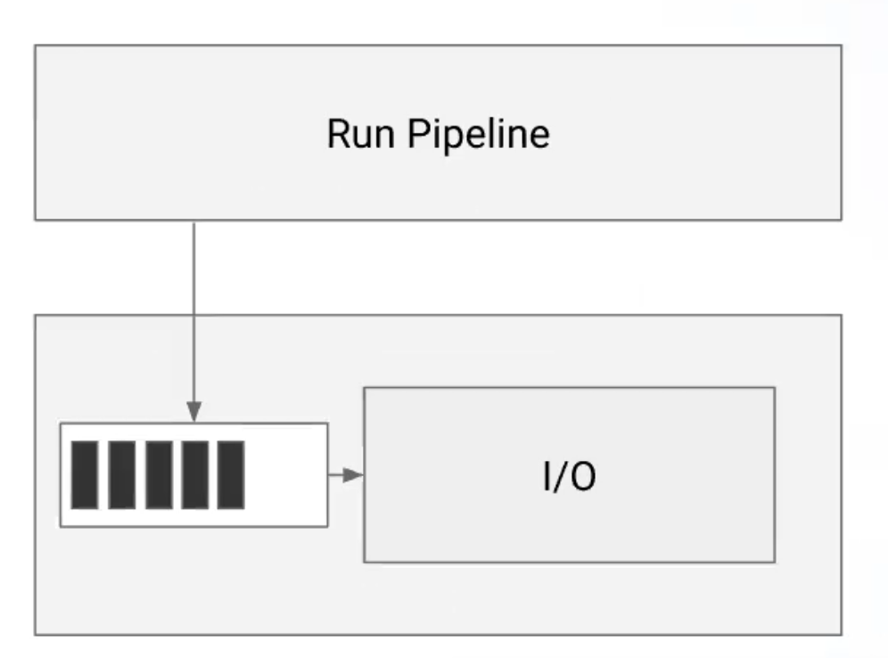
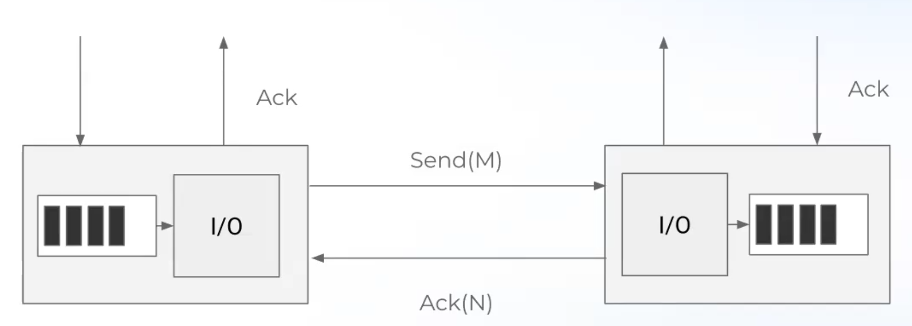
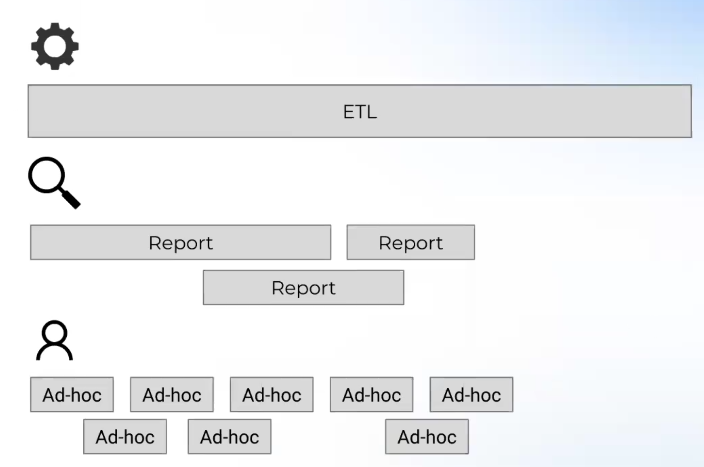
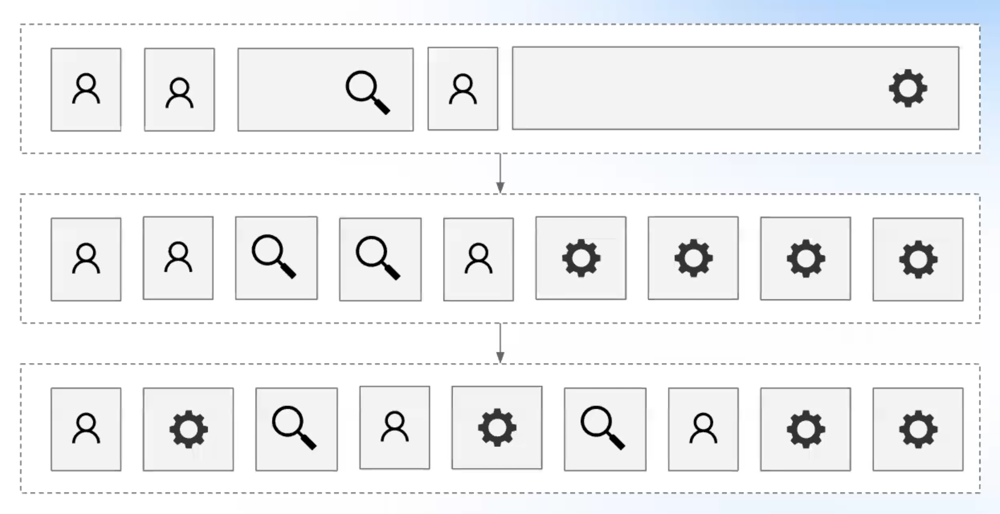
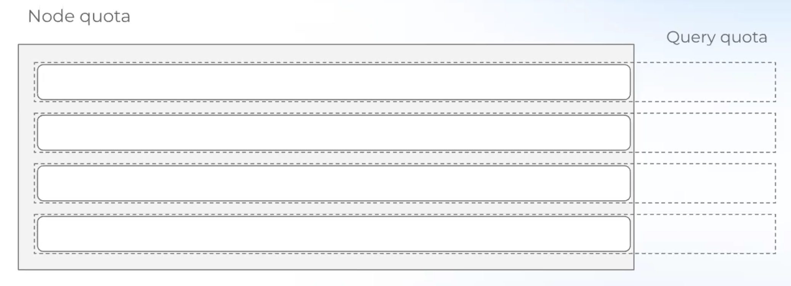
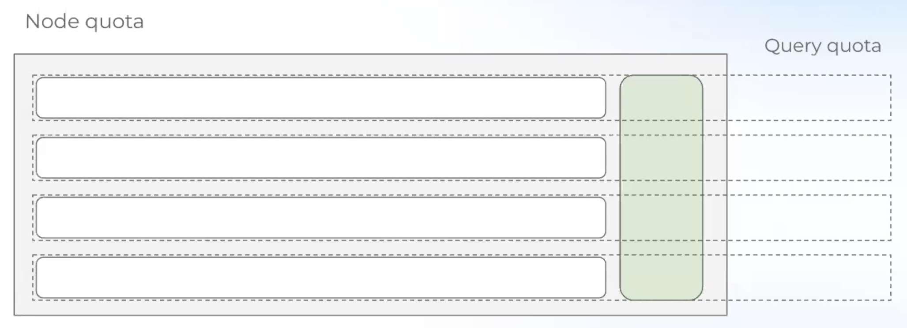
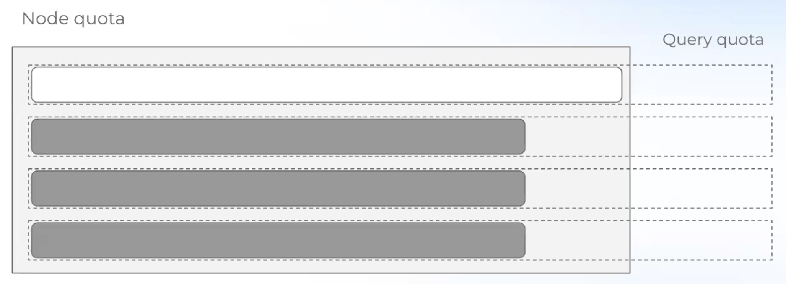
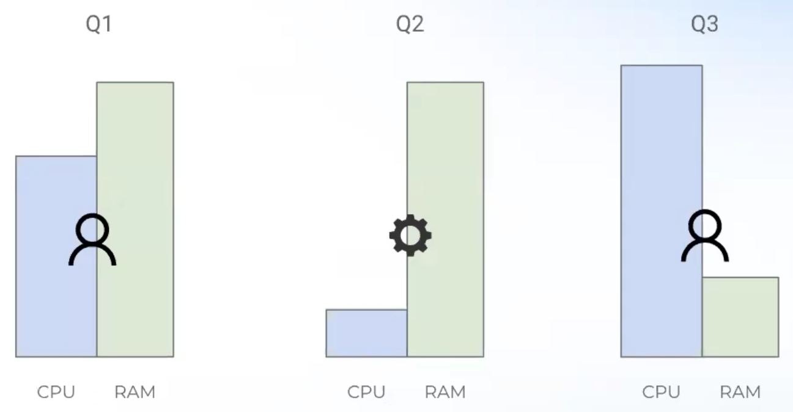
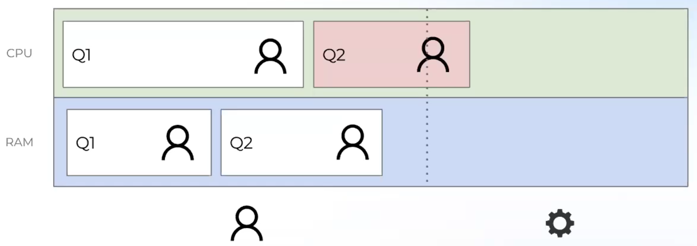
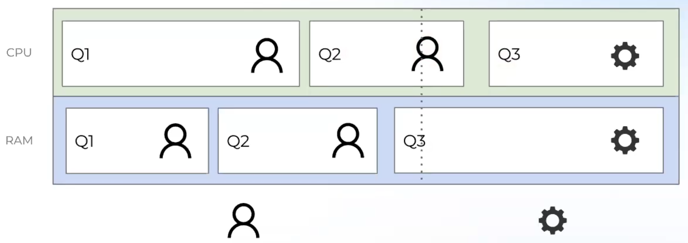

# Лекция 9. Оптимизации, несвязанные с операторами

### Backpressure
На самом деле, оператор `Exchange` состоит из трех частей: запись данных (`Sink`), передача между узлами, и чтение данных (`Source`). Во время передачи по сети поток простаивает (делают блокирующие системные вызовы) и таким образом может плохо утилизироваться CPU. Можно создать больше потоков, чем доступно ядер, но тогда в случае максимальное нагрузки будет много `involuntary context switch`-ей.

Распространненый способ борьбы с такой проблемой: завести два пула потоков, один для CPU-bound операций, другой для IO операций. Обычно это организовано так, что потоки из CPU-bound пула пишут в буфер (или какую-то очередь) данные для записи, а IO-потоки разгребают эту очередь, вызывая системные вызовы. Или наоборот, для `Source`-а данные приходят по сети, IO поток должен успевать наполнять буфер данными.

 
Верхний поток делает CPU-bound задачи, например, исполняя операторы в пайплайне, а нижний поток отправляет данные по сети.

Но есть проблемы: для `Sink`-а буфер может переполняться и в случае, если это блокирующая очередь, то поток, выполняющий CPU-bound задачи будет заблокирован; для `Source`-а буфер может быть пустым, и тогда CPU-bound поток будет простаивать.

Идея следующая: пускай писатель пишет сколько может, а читатель, если начинает "захлебываться", будет сообщать об этом писателю.
**Backpressure** – механизм, который позволяет балансировать между этими двумя крайностями. Это протокол, который позволяет обмениваться писателю и читателю информацией о том, готов ли читатель принять еще какой-то объем данных. Пока читатель не ответит, что готов, писатель не будет передавать данные. Конструкция, несколько похожая на семафор: писателю нужно взять "билет" у читателя прежде, чем он отправит новую порцию данных.
 

Плюсы: CPU-intensive потоки не блокируются, не читаем больше, чем можем обработать. Минусы: сложно отлаживать.

Есть готовые решения: RxJava, Akka, Apache Arrow.

### Scheduling

Бывают разные паттерны поведения пользователей. Обычно классифицирует на три типа: быстрые ad-hoc запросы (аналитики играются с данными), запросы построения отчетов, которые требуют обработки большего количества данных (выполняются вплоть до часов), долгие ETL запросы, которые могут выполняться десятками часов.

Есть некоторое ожидание от системы: легковесные запросы должны обрабатываться быстро, т.е. ad-hoc запрос не должен ждать 10 часов обработки ETL запроса. При этом, особо нет разницы, ETL запрос обрабатывается 10 часов 1 минуту или 10 часов 10 минут. 

Возникает идея: побить все время исполнения на кванты времени и при истечении времени кванта, запрос должен добровольно передавать выполнение другому запросу.

При этом, можем проталкивать вперед более легкие запросы.

Как выбрать вид запроса: по-умолчанию, считаем, что все запросы легковесные. Если запрос пора снимать с исполнения, то перемещаем его в более тяжелую категорию. Более легкие запросы имеют приоритет.

### Управление памятью
Высококардинальные `Join`-ы и `Aggregate`-ы могут потреблять очень большое количество памяти. С памятью нужно быть аккуратным, нельзя отдавать на откуп кому-то другому. Например, если в JVM закончится память, она выбросить `Out of Memory` исключение. Оно может быть брошено в любом потоке, даже в каком-то системном, которые не занимается обработкой запросов, и тогда может упасть процесс и система может стать недоступной. По-хорошему, проблемный запрос должен быть просто завершен с ошибкой. Таким образом, нужно вводить какие-то ограничения на потребление памятью.

Если система состоит из 1 узла, то можно выделять квоту на весь запрос. Если система состоит из нескольких узлов, то обычно квотируют [потребляемую память на узел] на запрос. Например, если квота на узел составляет 10 Гб, а на узле 64 Гб доступной памяти, то каждый узел может параллельно выполнять максимум `64 / 10 = 6` запросов. Заметим, если каждый из шести запросов потребляет всего 1 Гб, то получается, что на узле останется неиспользованных 58 Гб памяти, и при этом этот узел не сможет больше выполнять запросы.

Возникает потребность в **overcommit**-е. Если на узле еще есть достаточно памяти, то нужно отправлять на нее еще запросы. Тогда может возникнуть проблема, что в момент исполнения слишком большого количества запросов может потребоваться памяти больше (квота на память на запрос все еще не превышена), чем есть на узле.

На картинке выше видно, что любая последующая аллокация при исполнении любого запроса вызовет ошибку, связанную с исчерпанием памяти. 

Самый простой способ решения: убить процесс выполнения какого-то запроса. Разумнее всего убивать самый "молодой" запрос. Иначе может быть ситуация, когда запрос, время обработки которого занимает 1 минуту, убивает запрос, время обработки которого 10 часов, из которых 9 часов уже прошло.

Есть вариант сохранить всю память, которую использует запрос (все так же самый молодой), и сохранить ее на диск (**spilling**), чтобы потом, когда появится память, продолжить его исполнять не теряя прогресса.

Также встречается вариант (Presto) резервирования дополнительного буффера для overcommit-a, который может быть использован только для одного потока.
Допустим, ситуация приходит к тому, что память закончилась:

Тогда, все запросы, кроме одного, блокируются, а дополнительная память отдается одному оставшемуся запросу.

Важно, чтобы в ситации, когда на нескольких узлах происходит overcommit, все узлы синхронизировались, какой именно запрос они будут продолжать исполнять.

### Эксплуатация в облаке
На самом деле, запросы неравномерны в плане потребления ресурсов. Каким-то нужно много памяти и мало CPU, каким-то наоборот.

Допустим, что есть две различные команды, например, ETL и аналитики, использующие одну и ту же БД. У них разный бюджет и разные потребности для мощностей обработки запросов. Во-первых, можно их расселить по разным кластерам, и сделать мощность кластеров пропорционально их бюджету и каждая команда будет использовать только свой кластер. Но тогда может возникнуть проблема: аналитикам для выполнения запросов не хватает совсем немного CPU, при этом кластер, обрабатывающий ETL, мог бы поделиться ресурсами.

В таких ситуациях как раз-таки помогает облако, которое позволяет делиться ресурсами:

### Проекты
[Apache Calcite](https://github.com/apache/calcite) – фреймворк для оптимизаций. Поддерживает rule-ы, написан на Java.

[Apache Arrow](https://github.com/apache/arrow) – колоночный in-memory формат данных и рантайм. Умеет делать Expression Evaluation, реализвует операторы, есть поддержка JIT и Backpresure. Языки: C++, Java.

[Meta Velox](https://github.com/facebookincubator/velox) – аналог Apache Arrow, хорошо оптимизированный Execution слой, написан на C++.

[Apache Flink](https://github.com/apache/flink) – стриминговый SQL. Оптимизатор основан на Apache Calcite, Execution часть написана на Java.

[Presto](https://github.com/prestodb/presto)/[Trino](https://github.com/trinodb/trino) – федеративный SQL движок. Свой оптимизатор, отличный от Apache Calcite некоторыми идеями, например уникальные названия колонок вметсо индексов. 

[Dremio](https://github.com/dremio/dremio-oss) – аналог Presto/Trino. Использует Apache Calcite для оптимизатора, Apache Arrow для Execution. Не совсем открытый, какую-то часть кода публикуют.

[DuckDB](https://github.com/dremio/dremio-oss) – embedded аналитическая БД (single node). Свой оптимизатор и Exectution слой, написана на C++.

[CockroachDB](https://github.com/cockroachdb/cockroach) – настроенна на OLTP нагрузку система, написанная на Go. Полностью свой оптимизатор и Executrion слой.
